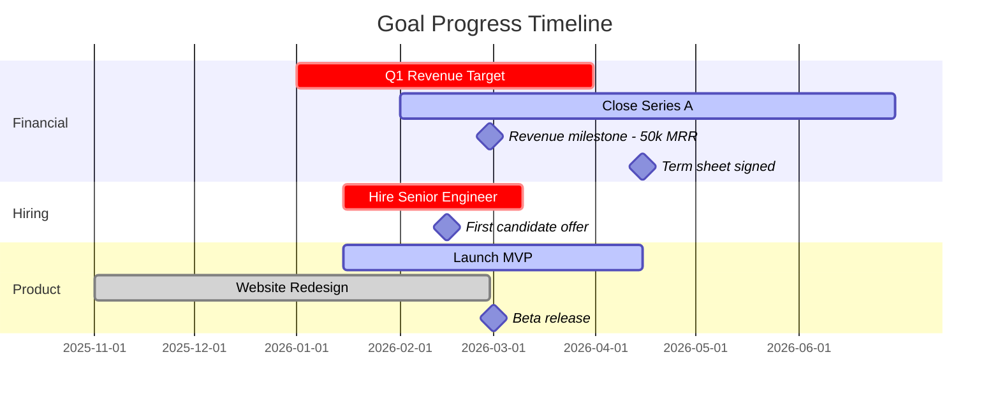

# Gantt Chart Generation

Generate Mermaid gantt charts from goal and milestone data. Produce a timeline visualization grouped by category with color-coded task bars and milestone markers.

---

## Base Syntax

Emit the following Mermaid block structure:

```
gantt
    dateFormat YYYY-MM-DD
    title Goal Progress Timeline
    section CategoryName
    GoalName :modifier, startDate, endDate
    MilestoneName :milestone, targetDate, 0d
```

Always include the `dateFormat YYYY-MM-DD` directive. Always include the `title Goal Progress Timeline` directive. Indent section contents with four spaces.

---

## Section Grouping

Create one `section` per Category value. Sort sections alphabetically by category name. Within each section, list goals first (sorted by start date ascending), then milestones for those goals (sorted by target date ascending).

If a goal has no category, place it in a section named `Uncategorized`. Position this section last, after all named categories.

---

## Color Directive Mapping

Map each goal's state to a Mermaid task modifier:

| Goal State | Modifier | Mermaid Rendering |
|:---|:---|:---|
| RAG = Red | `crit` | Red/critical styling |
| RAG = Yellow OR Status = "In Progress" | `active` | Blue/active styling |
| Status = "Completed" | `done` | Gray/done styling |
| RAG = Green | *(no modifier)* | Default green styling |
| Status = "Not Started" | *(no modifier)* | Default styling |

Apply modifiers in priority order: `done` takes precedence over all others (a completed goal is always `done` regardless of RAG). Then `crit` takes precedence over `active` (a red goal is critical even if in progress).

---

## Task Format

Render each goal as a task bar spanning from its start date to its target date:

```
GoalName :crit, 2026-01-01, 2026-06-30
```

- Use the goal's Created At date (or explicit Start Date if available) as the start date.
- Use the goal's Target Date as the end date.
- Do not wrap the goal name in quotes.
- Place one space after the goal name, then `:`, then the modifier (if any), then `,`, then the start date, then `,`, then the end date.

When a modifier applies:
```
Launch MVP :active, 2026-01-15, 2026-04-15
Q1 Revenue Target :crit, 2026-01-01, 2026-03-31
Website Redesign :done, 2025-11-01, 2026-02-28
Partner Strategy :2026-02-01, 2026-08-30
```

Note that tasks without a modifier omit the modifier field entirely — the line starts with `:startDate`.

---

## Milestone Format

Render each milestone as a diamond marker at its target date:

```
MilestoneName :milestone, 2026-03-15, 0d
```

- Always use `:milestone` as the modifier.
- Set duration to `0d` (zero days) to render as a point marker.
- Place milestones after their parent goal's task bar within the same section.

---

## Name Sanitization

Sanitize all goal and milestone names before emitting them in the Mermaid block. Apply these rules in order:

1. **Remove forbidden characters:** Strip all occurrences of `'`, `"`, `:`, `;`, `#`, `(`, `)`, `[`, `]`, `{`, `}`.
2. **Replace remaining special characters** (anything not alphanumeric, space, or hyphen) with a single hyphen.
3. **Collapse multiple consecutive hyphens** into a single hyphen.
4. **Trim leading and trailing hyphens and spaces.**
5. **Truncate to 40 characters.** If truncation falls mid-word, truncate at the last space before the 40-character boundary. Do not leave trailing hyphens or spaces after truncation.

Apply sanitization to the display name only. Do not modify the underlying data.

---

## 25-Node Cap

Count the total number of nodes (tasks + milestones) across all sections. If the total exceeds 25, apply the following reduction:

1. **Prioritize by RAG severity:** Include Red goals first, then Yellow, then Green, then Not Started.
2. **Within same RAG group:** Prioritize by Target Date proximity (nearest deadline first).
3. **Include milestones only for included goals.** If a goal is excluded, exclude its milestones too.
4. **Fill up to 25 nodes.** Count each task as 1 node and each milestone as 1 node.

After the Mermaid code block, append a footnote:

```
*Chart limited to 25 items. [N] additional goals/milestones omitted. Run /founder-os:goal:list for the complete view.*
```

Replace `[N]` with the count of omitted nodes.

---

## Omission Handling

Exclude goals without a Target Date from the Gantt chart entirely — a task bar requires both a start and end date. After the Mermaid code block, list omitted goals in a footnote:

```
*Goals without target dates (not shown): [Goal A], [Goal B], [Goal C].*
```

If no goals lack target dates, omit this footnote. If both the 25-node cap footnote and the no-target-date footnote apply, render them as separate lines.

---

## Complete Example

Given 3 categories, 5 goals, and 4 milestones:

````markdown

````

This example demonstrates:
- **Sections** sorted alphabetically: Financial, Hiring, Product.
- **`crit` modifier** on Red goals (Q1 Revenue Target, Hire Senior Engineer).
- **`active` modifier** on Yellow/In Progress goals (Close Series A, Launch MVP).
- **`done` modifier** on completed goals (Website Redesign).
- **Milestones** placed after their parent goals within the same section, using `:milestone` and `0d` duration.
- **No quotes** around any task or milestone names.

---

## Rendering Notes

Wrap the entire Mermaid block in a fenced code block with the `mermaid` language tag. Ensure exactly four spaces of indentation for all lines after `gantt`. Do not add blank lines between tasks within a section. Place one blank line between the last task of one section and the `section` declaration of the next (Mermaid tolerates this but does not require it — consistency matters more than the choice).
