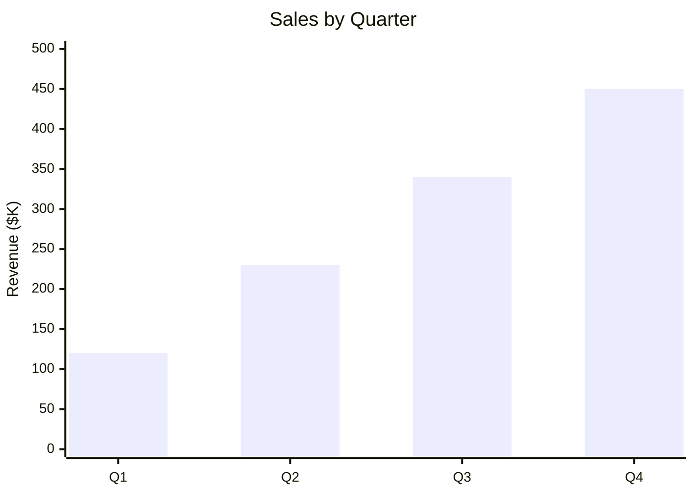
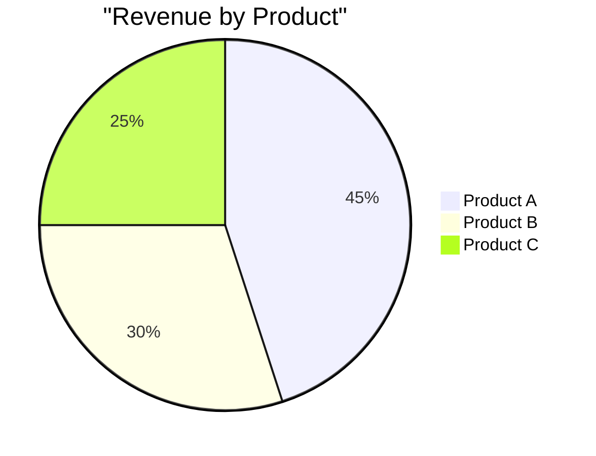
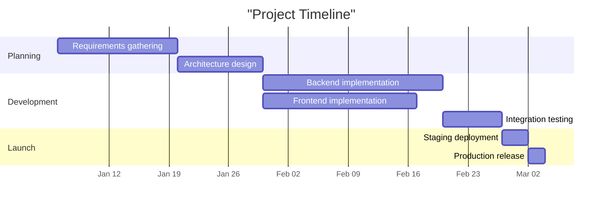
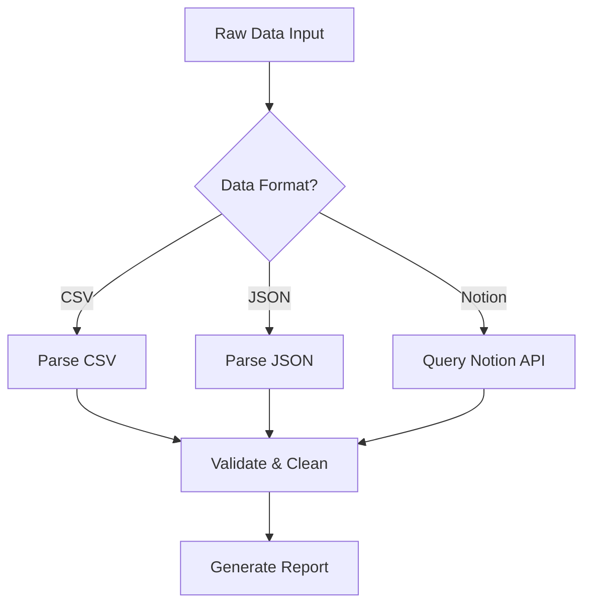

## Overview

Transform analyzed data into visual representations using Mermaid chart syntax and Markdown tables. Select the chart type based on data characteristics, render syntactically correct Mermaid blocks, and position visualizations to maximize reader comprehension. Mermaid is the exclusive charting engine -- chosen for native compatibility with GitHub, Notion, and Markdown renderers. Never generate image files, SVGs, or external dependencies. Every visualization must be a self-contained Mermaid code block or Markdown table.

## Chart Type Selection Matrix

Select exactly one chart type per visualization. When multiple types could apply, prefer the first type below that satisfies all conditions.

### Bar Chart (xychart-beta)

Select when data compares discrete categories against a numeric measure -- categorical X axis (product names, regions, quarters) and numeric Y axis (revenue, count). Use for ranking, comparison, or relative magnitude across 2 to 12 groups. Typical: revenue by product, headcount by department, tickets by category.

### Pie Chart

Select when data represents parts of a whole summing to a meaningful total. Use for composition and proportion with 2 to 8 segments. Exceeding 8 segments makes pie charts unreadable -- switch to bar or aggregate into "Other". Exclude any segment below 3% of the total. Typical: budget breakdown, time allocation, portfolio by industry.

### Line Chart (xychart-beta)

Select when data tracks a metric over sequential or temporal intervals. Use for trends, growth patterns, and trajectory with 3 to 50 data points. Fewer than 3 points lack trend significance -- use a callout or table instead. Typical: monthly revenue, weekly active users, sprint velocity over time.

### Gantt Chart

Select when data describes tasks or events with start dates and durations. Use for timelines, schedules, parallel workstreams, and duration comparison. Typical: project phases, roadmaps, sprint plans, campaign calendars.

### Flowchart

Select when data describes a process, decision tree, or data flow. Use for showing how inputs transform through sequential or branching steps. Typical: approval workflows, pipelines, customer journeys, decision trees.

## Mermaid Syntax Reference

Use these exact patterns. A single syntax error breaks the entire chart.

### Bar Chart



- Always include `title` in double quotes.
- The `x-axis` array and `bar` array must have equal length.
- Include units in the `y-axis` label: "Revenue ($K)", "Count".
- Start `y-axis` at 0; set ceiling to a round number 15-25% above the max value.
- Round decimal values to integers for display clarity.

### Line Chart

```mermaid
xychart-beta
    title "Monthly Users"
    x-axis ["Jan", "Feb", "Mar", "Apr"]
    y-axis "Users" 0 --> 1000
    line [200, 450, 600, 800]
```

- Same title, axis, and range rules as bar charts.
- For combined bar+line, include both series in one `xychart-beta` block with equal-length arrays. Use bar for absolute values, line for a secondary metric.

### Pie Chart



- `title` appears on the same line as `pie`, in double quotes.
- Each segment: `"Label" : value` (space-colon-space).
- Mermaid calculates proportions automatically; values need not sum to 100.
- Order segments largest to smallest.

### Gantt Chart



- Always specify `dateFormat YYYY-MM-DD` and `axisFormat` (`%b %d` or `%b %Y`).
- Use `after <task_id>` for sequential dependencies instead of hardcoding dates.
- Duration: `Nd` for N days. Group tasks into `section` blocks. Keep labels under 30 characters.

### Flowchart



- Use `TD` for process flows, `LR` for data pipelines.
- Node shapes: `["text"]` rectangle, `{"text"}` diamond, `(["text"])` stadium, `[["text"]]` subroutine.
- Label edges: `-->|label|`. Keep node text under 40 characters. Limit to 15 nodes maximum.

## Data-to-Chart Mapping Rules

Evaluate data structure before selecting a chart:

- **Categories + numeric values**: Bar chart.
- **Temporal sequence + numeric values**: Line chart.
- **Parts of a whole**: Pie chart.
- **Tasks with dates and durations**: Gantt chart.
- **Process steps with connections**: Flowchart.
- **Multi-dimensional** (3+ columns per row): Prefer a table, or combined bar+line if one dimension is primary.

### Data Volume Limits

| Chart Type | Max Points | When Exceeded |
|------------|-----------|---------------|
| Bar | 12 categories | Show Top N or aggregate into "Other" |
| Pie | 8 segments | Merge smallest into "Other" |
| Line | 50 points | Aggregate to coarser interval |
| Gantt | 20 tasks | Group into summary phases |
| Flowchart | 15 nodes | Collapse sub-processes |

When aggregating, state the method in surrounding text (e.g., "Top 10 by revenue", "Minor categories combined into Other").

### Derived Metrics

- Use raw values for bar charts (absolute comparison).
- Use derived metrics (percentages, growth rates) for line charts showing rate of change.
- Include both in a table when exact figures are needed alongside a chart.
- Never mix raw and derived values on the same axis.

## Chart Design Best Practices

### Titles

- State what the chart shows, not how to read it. Good: "Monthly Revenue by Product (2025)". Bad: "Bar Chart of Revenue".
- Keep under 60 characters. Include time period or scope when relevant.

### Axes and Units

- Label every axis with name and unit in parentheses: "Revenue ($K)", "Duration (days)".
- Currency: specify denomination ($, EUR). Use K/M/B suffixes.
- Start bar chart Y-axes at 0. Line charts may use non-zero floor when values cluster narrowly -- note this in text.
- Set Y-axis ceiling to a round number 15-25% above max value.

### Ordering

- Chronological: earliest to latest, left to right.
- Ranked: descending by value (largest leftmost) unless ascending is specified.
- Pie: largest to smallest, clockwise.

### Placement

- Limit 1-3 charts per section. Place each chart immediately after the paragraph referencing it.
- Separate consecutive charts with explanatory prose. Never stack charts back-to-back.
- Move supplementary charts to an appendix when a section exceeds 3 visualizations.

## Table Formatting

Use Markdown tables instead of charts when:
- Exact values are needed (charts sacrifice precision).
- Data has 3+ dimensions per row.
- There are 5 or fewer data points.
- Data mixes text and numbers.

### Rules

- Include header row and separator row. Right-align numbers (`---:`), left-align text (`:---`).
- Format numbers consistently within a column (same decimals, same units).
- Sort by primary numeric column descending unless chronological.
- Keep under 15 rows; show Top N with summary row for larger sets.
- Add bold **Total** row when values represent parts of a whole.

```markdown
| Product       | Revenue ($K) | Growth (%) | Status    |
|:--------------|-------------:|-----------:|:----------|
| Product A     |          450 |       12.3 | Growing   |
| Product B     |          320 |        5.1 | Stable    |
| Product C     |          180 |       -2.7 | Declining |
| **Total**     |      **950** |    **6.2** |           |
```

When combining chart and table for the same data, place the chart first for overview and the table second labeled "Exact figures:" for precision.

## Edge Cases

### Single Data Point

Do not chart a single value. Produce a callout block instead:

```markdown
> **Total Revenue (Q3 2025):** $450K -- up 12% from Q2
```

### All Values Identical

A chart adds no information when every value is the same. Use a callout: "All five regions reported identical revenue of $200K."

### Negative Values

Mermaid `xychart-beta` has limited negative support. For bar/line charts, set `y-axis` range to span below minimum and above maximum (e.g., `y-axis "Profit ($K)" -100 --> 300`). If rendering fails, fall back to a table. Never include negatives in pie charts -- filter them out and note the exclusion.

### Very Large Numbers

Apply suffix scaling when values exceed 6 digits:
- Thousands: divide by 1,000, label "(K)".
- Millions: divide by 1,000,000, label "(M)".
- Billions: divide by 1,000,000,000, label "(B)".

Apply the same factor to every value. Never mix scaled and unscaled values.

### Very Small Decimals

When all values are below 1.0, multiply by 100 and display as percentages when semantically appropriate. Otherwise use raw decimals with range `0 --> 1`.

### Missing Data Points

- Bar charts: omit the category or show 0 with footnote "No data available for [category]."
- Line charts: omit the point; Mermaid connects surrounding points. Note the gap in text.
- Tables: display "N/A" or "--" with footnote.

### Chart Rendering Failure

When Mermaid syntax cannot be validated or a known renderer limitation applies:
- Fall back to a Markdown table with the same data.
- Add `<!-- Chart rendering not supported; table fallback used -->` above the table.
- Log the attempted syntax and failure reason for the QA agent.
