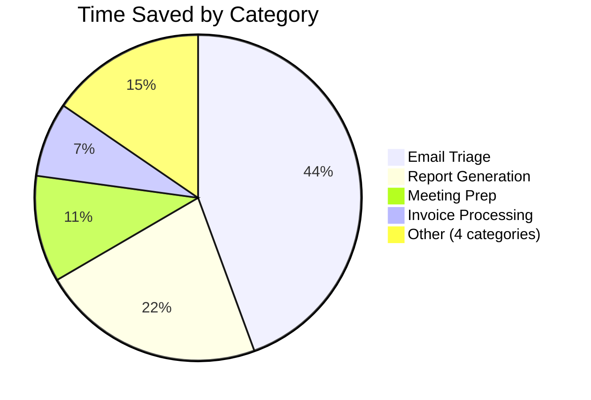
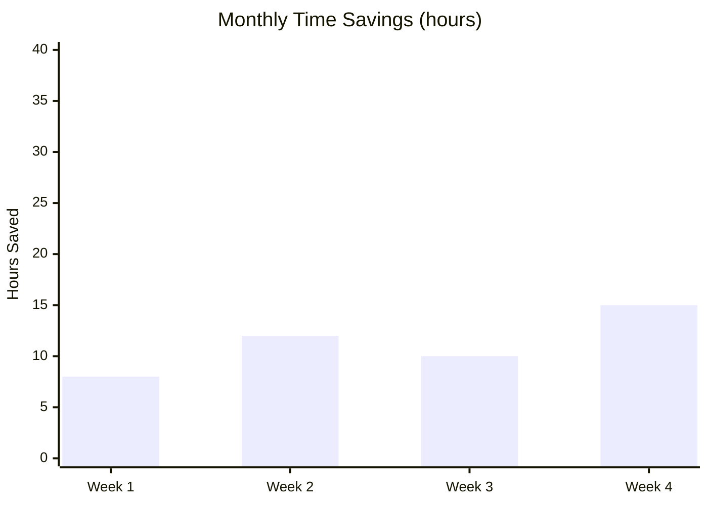

# ROI Calculation

Calculate time and money saved by using Founder OS plugins. Accept a DiscoveryResult array from the cross-plugin-discovery skill, apply time estimates per category, and produce structured reports with Mermaid charts. Referenced by: `/founder-os:savings:weekly`, `/founder-os:savings:monthly-roi`, `/founder-os:savings:quick`, `/founder-os:savings:configure`.

## Purpose and Context

Transform raw plugin task counts into actionable productivity metrics. Receive an array of DiscoveryResult objects (one per plugin category, each containing `category_key`, `completed_count`, `period_start`, `period_end`, and `status`), look up or override the corresponding time estimates, compute per-category and aggregate savings, and render the results as a 5-section Markdown report with embedded Mermaid charts. Use the detailed category reference at `${CLAUDE_PLUGIN_ROOT}/skills/savings/roi-calculation/references/time-estimates.md` for the full breakdown of all 24 category estimates and their rationale. Use `${CLAUDE_PLUGIN_ROOT}/config/task-estimates.json` as the authoritative machine-readable estimates data.

---

## Configuration Resolution

Resolve every configurable value using a strict priority order. Higher-priority sources override lower ones on a per-field basis — do not merge objects, replace individual keys.

### Priority Order (highest to lowest)

1. **Command flags** — `--rate=N`, `--currency=X` passed at invocation time
2. **User config file** — `${CLAUDE_PLUGIN_ROOT}/config/user-config.json` (if the file exists)
3. **Default values** — from `${CLAUDE_PLUGIN_ROOT}/config/task-estimates.json` (`hourly_rate_default: 150`, `currency: "USD"`)

### User Config Schema

Accept an optional user config file with the following shape:

```json
{
  "hourly_rate": 200,
  "currency": "EUR",
  "overrides": {
    "email_triage": { "manual_minutes": 90, "ai_minutes": 10 }
  }
}
```

- `hourly_rate` — override the default 150 rate globally
- `currency` — override the default USD currency code
- `overrides` — per-category estimate overrides keyed by `category_key` from task-estimates.json; each override object may specify `manual_minutes`, `ai_minutes`, or both

### Resolution Steps

1. Load `task-estimates.json` as the base configuration.
2. If `${CLAUDE_PLUGIN_ROOT}/config/user-config.json` exists, read it and apply `hourly_rate`, `currency`, and any category overrides on top of the base.
3. If command flags are present, apply them last — `--rate` replaces hourly_rate, `--currency` replaces currency.
4. Validate every resolved category: `manual_minutes` must be greater than `ai_minutes`, and both must be greater than 0. Skip any category that fails validation and emit a warning.

---

## Per-Category Calculation

For each DiscoveryResult where `status == "found"` and `completed_count > 0`, compute the following metrics.

### Estimate Lookup

1. Extract `category_key` from the DiscoveryResult.
2. Look up the matching entry in the resolved task-estimates (base + user overrides).
3. Read `manual_minutes` and `ai_minutes` from the resolved entry.

### Formulas

| Metric | Formula |
|--------|---------|
| `time_saved_minutes` | `(manual_minutes - ai_minutes) * completed_count` |
| `time_saved_hours` | `time_saved_minutes / 60` |
| `dollar_value` | `time_saved_hours * hourly_rate` (skip if `hourly_rate == 0`) |
| `roi_multiplier` | `manual_minutes / ai_minutes` (e.g., "8x faster") |
| `efficiency_gain_pct` | `((manual_minutes - ai_minutes) / manual_minutes) * 100` |

### Per-Category Output Object

Produce one object per category:

```
{
  "category_key": "email_triage",
  "plugin": "P01 Inbox Zero Commander",
  "completed_count": 12,
  "manual_minutes": 120,
  "ai_minutes": 15,
  "time_saved_minutes": 1260,
  "time_saved_hours": 21.0,
  "dollar_value": 3150.00,
  "roi_multiplier": 8.0,
  "efficiency_gain_pct": 87.5,
  "unit": "per batch"
}
```

---

## Aggregate Metrics

Sum and derive the following from all per-category results.

### Summation Metrics

| Metric | Derivation |
|--------|------------|
| `total_hours_saved` | Sum of all `time_saved_hours` |
| `total_dollar_value` | Sum of all `dollar_value` (omit entirely if `hourly_rate == 0`) |
| `equivalent_work_days` | `total_hours_saved / 8` |
| `total_tasks` | Sum of all `completed_count` |

### Projection Metrics

Calculate the number of days in the reporting period as `days_in_period` (difference between `period_end` and `period_start` in calendar days, minimum 1).

| Metric | Formula |
|--------|---------|
| `annualized_hours` | `total_hours_saved * (365 / days_in_period)` |
| `annualized_value` | `total_dollar_value * (365 / days_in_period)` (omit if rate == 0) |
| `monthly_avg_hours` | `annualized_hours / 12` |
| `monthly_avg_value` | `annualized_value / 12` (omit if rate == 0) |

### Derived Metrics

| Metric | Formula |
|--------|---------|
| `avg_roi_multiplier` | Weighted average of per-category `roi_multiplier`, weighted by `completed_count` |
| `top_saver` | Category with the highest `time_saved_hours` |
| `active_plugins` | Count of categories where `status == "found"` and `completed_count > 0` |

---

## Report Structure

Generate a 5-section Markdown report. Adapt section content based on the hourly rate gate (see below) and available data.

### Section 1: Executive Summary

Present the headline metrics in a compact block:

```
## Executive Summary

- **Total Hours Saved**: 47.3 hours
- **Equivalent Work Days**: 5.9 days
- **Dollar Value**: $7,095.00 (at $150/hr)
- **Top Saver**: Email Triage (21.0 hours)
- **Active Plugins**: 8 of 24
- **Average ROI**: 6.2x faster
```

Omit the "Dollar Value" line when the hourly rate gate is active.

### Section 2: Category Breakdown

Render a Markdown table with one row per active category, sorted by `time_saved_hours` descending.

Full table columns (when hourly rate is set):

```
| Category | Tasks | Manual Time | AI Time | Time Saved | Value | ROI |
|----------|-------|-------------|---------|------------|-------|-----|
| Email Triage | 12 batches | 24.0h | 3.0h | 21.0h | $3,150 | 8.0x |
```

Omit the "Value" column when the hourly rate gate is active.

Format `Manual Time` and `AI Time` as total hours for the period (not per-task minutes). Append the unit from task-estimates.json to the Tasks column value (e.g., "12 batches", "5 meetings").

### Section 3: Top Savers

Rank the top 5 categories by `time_saved_hours`. Present as a numbered list with a brief insight per entry:

```
## Top Savers

1. **Email Triage** — 21.0h saved across 12 batches (8.0x faster)
2. **Report Generation** — 10.5h saved across 3 reports (8.0x faster)
3. ...
```

If fewer than 5 categories are active, list all active categories.

### Section 4: Trend Visualization

Embed a Mermaid chart appropriate to the report type. Select the chart type based on the data shape:

#### Single-Period Reports (weekly, quick)

Generate a pie chart showing the proportional time saved by category:



Limit the pie chart to the top 5 categories. Roll remaining categories into a single "Other (N categories)" slice.

#### Multi-Period Reports (monthly-roi)

Generate a bar chart using xychart-beta showing weekly totals across the month:



Set the y-axis upper bound to the nearest multiple of 10 above the maximum weekly value.

### Section 5: Projections

Extrapolate the period data to annual and monthly estimates:

```
## Projections

Based on the current **7-day** reporting period:

- **Annualized Hours Saved**: 2,460 hours
- **Annualized Dollar Value**: $369,000
- **Monthly Average**: 205 hours / $30,750

> These projections assume consistent usage. Actual results vary with workload.
```

Omit dollar projection lines when the hourly rate gate is active. Always include the disclaimer note.

---

## Chart Generation Rules

Apply these rules when building any Mermaid chart block:

1. Round all numeric values to one decimal place.
2. Use category display names (from the `description` field in task-estimates.json), shortened to 2-3 words maximum for chart labels.
3. Wrap the chart in a fenced code block with the `mermaid` language identifier.
4. For pie charts, include a maximum of 6 slices (top 5 + "Other" rollup).
5. For bar charts, label x-axis entries by week number within the period.
6. Never generate a chart with zero data — omit the Trend Visualization section entirely if `total_hours_saved == 0`.

---

## Hourly Rate Gate

When `hourly_rate` resolves to 0 or is explicitly unset, suppress all dollar-denominated output while preserving all time-based metrics.

### Fields to Omit When Rate is 0

| Report Section | Omitted Element |
|----------------|-----------------|
| Executive Summary | "Dollar Value" line |
| Category Breakdown | "Value" column |
| Projections | "Annualized Dollar Value" and dollar portion of "Monthly Average" |
| Aggregate metrics | `total_dollar_value`, `annualized_value`, `monthly_avg_value` |

### Fields to Preserve When Rate is 0

All time-based metrics remain: `total_hours_saved`, `equivalent_work_days`, `annualized_hours`, `monthly_avg_hours`, `roi_multiplier`, `efficiency_gain_pct`, and all chart data (charts always use hours, never dollars).

---

## Quick Summary Format

For the `/founder-os:savings:quick` command, produce a condensed single-block output instead of the full 5-section report:

```
Founder OS Savings (last 7 days):
  47.3 hours saved | 5.9 work days | $7,095 value
  Top: Email Triage (21.0h) | 8 active plugins | Avg 6.2x ROI

  Email Triage:     21.0h (12 batches)
  Report Gen:       10.5h (3 reports)
  Meeting Prep:      5.0h (10 meetings)
  ... +5 more categories
```

Limit the category list to the top 3. Show "+N more categories" for the remainder. Omit the dollar value line when the hourly rate gate is active.

---

## Edge Cases

Handle the following conditions:

| Condition | Behavior |
|-----------|----------|
| Zero active categories | Return a message: "No plugin activity found for the specified period." — no report, no charts |
| Single active category | Generate report normally; pie chart has one slice; Top Savers list has one entry |
| `completed_count` is 0 for a found category | Exclude from report (treat as inactive) |
| User override makes `ai_minutes >= manual_minutes` | Skip that category, emit warning: "Override for [key] invalid: ai_minutes must be less than manual_minutes" |
| Period shorter than 1 day | Set `days_in_period` to 1 for projection calculations |
| Very large projections | Cap annualized display at 2 decimal places; add "(projected)" label |

---

## Additional Resources

- Refer to `${CLAUDE_PLUGIN_ROOT}/skills/savings/roi-calculation/references/time-estimates.md` for the detailed breakdown of all 24 category estimates, their derivation methodology, and customization guidance.
- Refer to `${CLAUDE_PLUGIN_ROOT}/config/task-estimates.json` for the authoritative machine-readable estimates data used by the calculation engine.
- Refer to the cross-plugin-discovery skill for the DiscoveryResult schema and data gathering pipeline that feeds into this skill.
