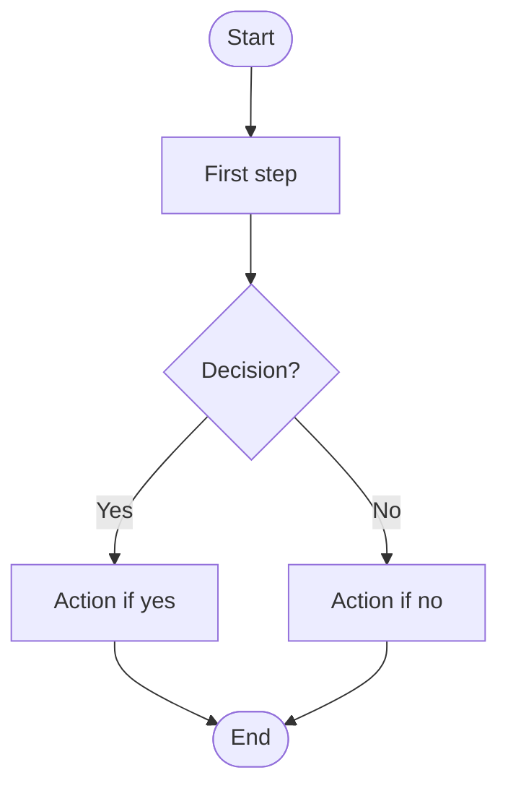

# /founder-os:workflow-doc:diagram

Generate a quick Mermaid flowchart from a workflow description or an existing documented SOP. This is a lightweight companion to `/founder-os:workflow:document` — it produces a visual diagram without the full 7-section SOP pipeline. Ephemeral by default (chat only). Never writes to Notion.

## Load Skills

Read both skills before starting:
1. `skills/workflow-doc/workflow-documentation/SKILL.md`
2. `skills/workflow-doc/sop-writing/SKILL.md`

## Parse Arguments

Extract from `$ARGUMENTS`:
- **description-or-workflow-name** — all text before `--` flags. This is either a short workflow name (for Notion lookup) or a longer workflow description (for fresh diagramming).
- `--output=PATH` (optional) — save diagram to a minimal .md file at the specified path. If omitted, display in chat only.

## Business Context (Optional)
Check if context files exist at `_infrastructure/context/active/`. If the directory contains `.md` files, read `business-info.md`, `strategy.md`, and `current-data.md`. Use this context to personalize output (e.g., prioritize known clients, use correct terminology, align with current strategy). If files don't exist, skip silently.

## Preflight Check
Read the preflight skill at `../../../.founderOS/infrastructure/preflight/SKILL.md`.
Run the preflight check for the `workflow-doc` namespace.
If the check returns `blocked`, stop execution and display the fix instructions.
If the check returns `degraded`, note which optional sources are unavailable and adjust later steps accordingly.

## Step 0: Memory Context
Read the context-injection skill at `_infrastructure/memory/context-injection/SKILL.md`.
Query for memories relevant to the current input (company, contacts, topics detected in arguments).
If memories are returned, incorporate them into your working context for this execution.

## Observation: Start
Before executing, record a pre_command event to the Intelligence event store (`_infrastructure/intelligence/.data/intelligence.db`):
- Event type: `pre_command`
- Plugin: `workflow-documenter`
- Command: `workflow-doc-diagram`
- Generate a session_id (UUID) and reuse it for all subsequent events in this execution
- Payload: record input parameters, context files loaded, and any memories injected
- If the Intelligence database does not exist, skip observation silently and continue execution

## Intelligence: Apply Learned Patterns
Before executing the main logic, check for learned patterns in the Intelligence database (`_infrastructure/intelligence/.data/intelligence.db`):
1. Query: `SELECT instruction, description FROM patterns WHERE (plugin = 'workflow-documenter' OR plugin IS NULL) AND (command = 'workflow-doc-diagram' OR command IS NULL) AND status IN ('active', 'approved') ORDER BY confidence DESC`
2. If patterns found, apply each instruction as additional context for this execution
3. Notify: `[Intel] Applying learned preference: "{description}"` for each pattern applied
4. If the Intelligence database does not exist, skip silently and continue execution

## Self-Healing: Error Recovery
If any error occurs during this command:
1. Classify the error using rules from `_infrastructure/intelligence/self-healing/SKILL.md`
2. Check if healing is enabled: query `SELECT value FROM config WHERE key = 'healing.enabled'` from Intelligence DB
3. For transient errors: retry with exponential backoff (2s, 5s, 15s)
4. For recoverable errors: look up fix in healing_patterns table, apply if found
5. For degradable errors: consult fallback registry in `_infrastructure/intelligence/self-healing/fallback-registry/SKILL.md`, execute fallback path
6. For fatal errors: stop and present error with suggested fix
7. Always notify: `[Heal] {description of what happened and what was done}`
8. Record error event to Intelligence DB with recovery_attempted field
9. If Intelligence DB is unavailable, fall back to existing error handling (no self-healing)

## Input Resolution

### Step 1: Determine Input Type

1. **No input provided**: Prompt via AskUserQuestion: "Describe the workflow to diagram, or name an existing documented workflow." Then stop and wait for response.
2. **Short input (<50 characters)**: Treat as a workflow name. Attempt Notion lookup (Step 2).
3. **Long input (50+ characters)**: Treat as a fresh workflow description. Skip to Generate Diagram.

### Step 2: Notion Lookup (short input only)

Search for a Notion database titled "[FOS] Workflows" first. If not found, try "Founder OS HQ - Workflows". If not found, fall back to "Workflow Documenter - SOPs" (legacy DB name):
1. If a database is found, query it for a page whose Title matches the input (case-insensitive, partial match acceptable). When querying the consolidated HQ database, filter by Type="SOP" to exclude Execution records.
2. If a matching SOP is found, extract the step sequence from the stored SOP record. Use these steps as the source for diagram generation.
3. If no matching SOP is found, neither database exists, or Notion CLI is unavailable, silently skip lookup and treat the short input as a fresh workflow description.

Do NOT error on Notion failures. Proceed silently with the input text as-is.

## Generate Diagram

### Step 1: Extract Workflow Steps

Using the workflow-documentation skill, decompose the input into an ordered list of discrete steps:
- Identify sequential actions, decision points, and outcomes
- Distinguish between action steps (things someone does) and decision points (yes/no or branching questions)
- Identify the start condition and end state(s)
- Collapse overly granular steps — aim for 5-20 steps for clarity

### Step 2: Build Mermaid Flowchart

Using the sop-writing skill's diagram rules, generate a Mermaid flowchart:

- Use `flowchart TD` (top-down orientation)
- **Node shapes**:
  - Rounded rectangles for start/end nodes: `([Start])`, `([End])`
  - Standard rectangles for action steps: `[Step description]`
  - Diamonds for decision points: `{Decision question?}`
- **Maximum 25 nodes** — if the workflow exceeds this, consolidate related steps into grouped nodes
- **Edge labels** for decision branches: `-->|Yes|` and `-->|No|` (or other branch labels as appropriate)
- **Character sanitization**: Remove or escape characters that break Mermaid syntax — quotes, parentheses within node text, special characters. Replace with plain alternatives.
- **Node IDs**: Use short sequential IDs (`A`, `B`, `C`... or `A1`, `A2` for sub-steps)
- Keep node text concise — max ~40 characters per node label

## Display Output

### Diagram

Show the diagram in a fenced mermaid code block:

````

````

### Summary

After the diagram, display:

```
**Steps**: [step_count] | **Decisions**: [decision_count] | **Handoffs**: [handoff_count] | **Complexity**: [Simple|Moderate|Complex|Very Complex]
```

Complexity tiers (from workflow-documentation skill):
- **Simple**: 1-5 steps, 0-1 decisions, 0 handoffs
- **Moderate**: 6-10 steps, 2-3 decisions, 1-2 handoffs
- **Complex**: 11-15 steps, 4-5 decisions, 3-4 handoffs
- **Very Complex**: 16-20 steps, 6+ decisions, 5+ handoffs

If the workflow needed consolidation to fit 25 nodes, note: "Consolidated from [original_count] steps to fit diagram limits. Run `/founder-os:workflow:document` for the full SOP."

## File Output (when --output provided)

Save a minimal .md file to the specified path:

```yaml
---
workflow_name: "[name derived from input]"
generated_at: "[ISO 8601 timestamp]"
---
```

Followed by the mermaid code block only. No SOP content, no summary, no additional sections.

If the `--output` path includes directories that do not exist, note the error and suggest a valid path. Do not create directories.

When file output is saved, confirm: "Diagram saved to `[path]`"

## Observation: End
After execution completes, record a post_command event to the Intelligence event store:
- Event type: `post_command`
- Use the same session_id from the start observation
- Outcome: `success` | `failure` | `degraded`
- Payload: { outcome summary, items processed, outputs created }
- Duration: milliseconds elapsed since pre_command event
- If any errors occurred during execution, also record an error event with the error type, message, and whether recovery was attempted

## Final: Memory Update
Read the pattern-detection skill at `_infrastructure/memory/pattern-detection/SKILL.md`.
Log this execution as an observation with: plugin name, primary action performed, key entities (companies, contacts), and output summary.
Check for emerging patterns per the detection rules. If a memory reaches the adaptation threshold, append the notification to the output.

## Graceful Degradation

**Notion unavailable during lookup**: Silently skip lookup. Treat input as a fresh description. No error message.

**Cannot parse into coherent steps**: If the input is too vague or ambiguous to extract a meaningful step sequence, display:
"Could not extract a clear workflow from this description. Try:
- Adding more detail about the specific steps involved
- Running `/founder-os:workflow:document` for guided SOP creation with step-by-step prompts"

**No input**: Prompt via AskUserQuestion as described in Input Resolution Step 1.

## Usage Examples

```
/founder-os:workflow:diagram "Invoice Approval Process"
/founder-os:workflow:diagram "User signs up, verifies email, completes profile, gets welcome tour, starts first project"
/founder-os:workflow:diagram "client onboarding" --output=diagrams/onboarding-flow.md
```
