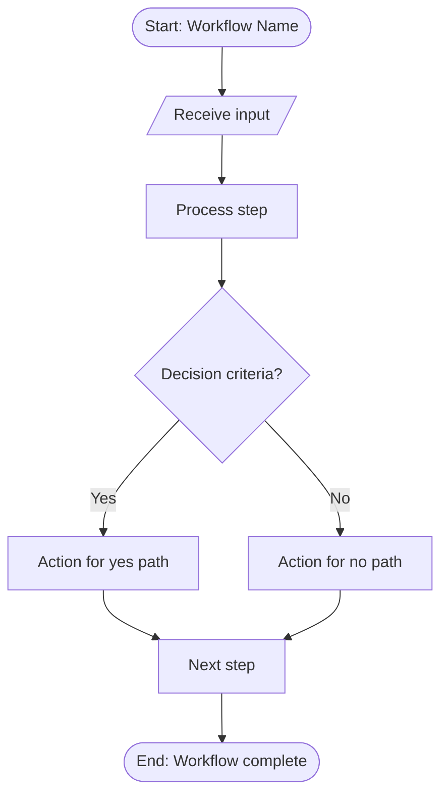

# SOP Writing

Generate structured, complete Standard Operating Procedures from raw process descriptions, interviews, or workflow observations. Used by: `/founder-os:workflow:document` (full SOP generation), and any command that requires converting unstructured process knowledge into a repeatable, auditable procedure document.

## Purpose and Context

Transform raw process descriptions, verbal walkthroughs, meeting notes, or ad-hoc workflow knowledge into formal SOPs that any team member can follow without prior context. Every SOP must follow the 7-section structure, enforce imperative writing style, include a Mermaid flowchart diagram, and generate troubleshooting entries proportional to the workflow's complexity. Use the detailed section guidelines at `skills/workflow-doc/sop-writing/references/sop-sections.md` as the authoritative reference for per-section formatting, required content, and common mistakes.

---

## 7-Section SOP Structure

Every SOP follows a fixed 7-section architecture. Each section serves a distinct purpose and has specific content requirements. Refer to `skills/workflow-doc/sop-writing/references/sop-sections.md` for detailed per-section guidelines, example content, minimum requirements, and common mistakes to avoid.

| Section | Title | Purpose |
|---------|-------|---------|
| 1 | Workflow Overview | Identify the workflow name, purpose, owner, and last-updated date |
| 2 | Prerequisites | List tools, access credentials, knowledge, and dependencies required before starting |
| 3 | Step-by-Step Procedure | Define every step with actor, action, and expected output |
| 4 | Decision Points | Map if/then branches with explicit criteria for each path |
| 5 | Handoff Protocol | Specify who hands off to whom, what artifacts transfer, and acceptance criteria |
| 6 | Troubleshooting | Provide symptom-cause-resolution entries for common failure modes |
| 7 | Revision History | Track changes with date, author, and change summary |

### Section Relationships

Sections 3, 4, and 5 form the operational core. Extract decision points from the step-by-step procedure -- every "if" or conditional in Section 3 generates a corresponding entry in Section 4. Every change of actor between consecutive steps in Section 3 generates a handoff entry in Section 5. Section 6 draws its entries from Sections 4 and 5.

---

## Writing Style Rules

Apply these rules to every sentence in every section of the SOP.

### Imperative Mood

Write every instruction as a direct command. Begin each step with an action verb.

| Correct | Incorrect |
|---------|-----------|
| Open the dashboard and select "New Report" | The user should open the dashboard |
| Verify the total matches the invoice amount | The total should be verified against the invoice |
| Send the approval email within 2 business days | An approval email is sent within 2 business days |

### Present Tense

Describe all actions and outcomes in present tense. Never use future tense ("will be") or past tense ("was completed") in procedural steps.

### No Passive Voice

Rewrite every passive construction as an active command. Identify the actor and make them the subject.

| Passive (Avoid) | Active (Use) |
|-----------------|--------------|
| The report is reviewed by the manager | The manager reviews the report |
| Approval is granted after verification | Grant approval after verification completes |
| The file is uploaded to the shared drive | Upload the file to the shared drive |

### Maximum 30 Words Per Step Instruction

Limit each step instruction to 30 words or fewer. When a step requires more detail, split it into sub-steps (e.g., 3a, 3b, 3c) rather than writing a long compound sentence. Count only the instruction text -- exclude the actor label and expected output from the word count.

### Vocabulary Consistency

Use the same term for the same concept throughout the document. Define terminology in Section 2 (Prerequisites) when a workflow uses domain-specific vocabulary. Never alternate between synonyms (e.g., do not switch between "submit", "send", and "forward" for the same action).

---

## Troubleshooting Generation Rules

Generate troubleshooting entries for Section 6 using these calculation rules.

### Entry Count Formula

Calculate the required number of entries:

- **1 entry per decision point** in Section 4 -- cover the failure mode when the wrong branch is taken or criteria are ambiguous.
- **1 entry per handoff** in Section 5 -- cover the failure mode when the handoff is incomplete, delayed, or rejected.
- **1 escalation entry** (always) -- cover the case when none of the other troubleshooting entries resolve the issue.

### Bounds

- **Minimum**: 3 entries (even if the formula produces fewer, pad with the most likely failure scenarios).
- **Maximum**: 10 entries (if the formula produces more, prioritize by frequency of occurrence and severity of impact, then truncate).

### Entry Format

Structure every troubleshooting entry as a three-column row:

| Symptom | Cause | Resolution |
|---------|-------|------------|

- **Symptom**: Describe what the user observes. Use specific, observable language ("Dashboard displays 'Error 403'" not "Something goes wrong").
- **Cause**: State the root cause in one sentence.
- **Resolution**: Provide 1-3 numbered action steps to resolve. Use the same imperative style as Section 3.

### Escalation Entry

The final entry in every troubleshooting table must be the escalation path:

| Symptom | Cause | Resolution |
|---------|-------|------------|
| Issue persists after following all resolution steps above | Root cause falls outside this SOP's scope | 1. Document the symptom and steps already attempted. 2. Contact [escalation contact/team] via [channel]. 3. Include the SOP name and section reference in the escalation message. |

Fill in the escalation contact and channel based on the workflow owner defined in Section 1.

---

## Mermaid Diagram Generation Rules

Generate one Mermaid flowchart per SOP. Place it between Sections 3 and 4 (after the step-by-step procedure, before decision points) as a visual summary of the workflow.

### Diagram Type

Always use `flowchart TD` (top-down orientation). Never use `graph`, `flowchart LR`, or other orientations unless the workflow is explicitly horizontal (e.g., a timeline).

### Node Shape Conventions

Use consistent shapes to convey node type at a glance:

| Node Type | Mermaid Syntax | Shape | Use For |
|-----------|---------------|-------|---------|
| Start/End | `([label])` | Rounded rectangle (stadium) | First and last nodes only |
| Process Step | `[label]` | Rectangle | Standard action steps |
| Decision | `{label}` | Diamond | If/then branch points |
| Input/Output | `[/label/]` | Parallelogram | Data entry, file upload, report output |

### Node Limit

Cap every diagram at 25 nodes maximum. When a workflow exceeds 25 steps, group related steps into sub-process nodes (e.g., "Complete QA checks" instead of 5 individual QA step nodes). Add a note below the diagram referencing the detailed steps in Section 3.

### Edge Labels

Label every edge leaving a decision node with the condition that triggers that path. Use concise labels (2-5 words).

```
D1{Amount > $5,000?} -->|Yes| S5[Route to VP approval]
D1 -->|No| S6[Route to manager approval]
```

Never leave decision edges unlabeled. Non-decision edges (sequential steps) do not require labels.

### Character Sanitization

Mermaid parsers break on unescaped special characters in node labels. Apply these sanitization rules before generating the diagram:

- **Double quotes**: Replace `"` with `&quot;` or remove entirely.
- **Parentheses**: Replace `(` with `&#40;` and `)` with `&#41;`, or rewrite the label to avoid them.
- **Square brackets**: Replace `[` with `&#91;` and `]` with `&#93;`, or rewrite.
- **Curly braces in labels**: Avoid entirely -- curly braces define node shapes in Mermaid.
- **Ampersands**: Replace `&` with `&amp;` or use "and".
- **Pipe characters**: Replace `|` with "or" -- pipes define edge labels in Mermaid.

Test mentally: if the label contains any of `"()[]{}|&`, sanitize or rewrite before including it in the diagram.

### Diagram Structure Pattern

Follow this skeleton for every SOP diagram:



Name nodes with a prefix that indicates type: `S` for steps, `D` for decisions, `IO` for inputs/outputs. Number sequentially. Always include exactly one START and one END node.

---

## Section Omission Rules

Not every workflow contains decision points or handoffs. Apply these rules to keep the SOP clean and honest rather than padding with empty sections.

### No Decision Points

When the workflow is a linear sequence with no conditional branches:

- Omit Section 4 entirely.
- Insert a single-line note in its place: **"Section 4 - Decision Points: No decision points identified in this workflow. All steps follow a linear sequence."**
- The 3-entry minimum still applies. Generate 2 entries from the most likely failure scenarios in the linear procedure plus the escalation entry.

### No Handoffs

When the workflow has a single actor from start to finish with no transfers of responsibility:

- Omit Section 5 entirely.
- Insert a single-line note in its place: **"Section 5 - Handoff Protocol: No handoffs identified. This workflow is executed by a single actor throughout."**
- Reduce the troubleshooting entries accordingly (no handoff entries to generate), but maintain the 3-entry minimum.

### Both Omitted

When neither decision points nor handoffs exist, the SOP contains Sections 1, 2, 3, 6, and 7 with placeholder notes for Sections 4 and 5. The troubleshooting section still requires 3 entries minimum: 2 based on the most likely failure points in the linear procedure + 1 escalation entry.

---

## SOP Output Formatting

### File Naming

Name every SOP file using the pattern: `sop-[workflow-slug]-[YYYY-MM-DD].md`. Derive the workflow slug from the workflow name in Section 1 (lowercase, hyphens for spaces, strip special characters).

### Markdown Structure

Use H2 (`##`) for section headings, H3 (`###`) for subsections within a section. Never use H1 -- the document title is the workflow name from Section 1, rendered as a YAML-style metadata block or the first H2.

### Tables

Use Markdown tables for:
- Prerequisite lists (Tool | Purpose | Access Level)
- Step-by-step procedures (Step # | Actor | Action | Expected Output)
- Decision points (Decision | Criteria | Yes Path | No Path)
- Handoffs (From | To | Artifact | Acceptance Criteria)
- Troubleshooting (Symptom | Cause | Resolution)

### Content Length Targets

- **Total SOP**: 1,500-4,000 words depending on workflow complexity.
- **Section 1 (Overview)**: 50-100 words.
- **Section 2 (Prerequisites)**: 100-300 words.
- **Section 3 (Procedure)**: 400-1,500 words (scales with step count).
- **Section 4 (Decision Points)**: 100-500 words (scales with branch count).
- **Section 5 (Handoffs)**: 100-400 words (scales with actor count).
- **Section 6 (Troubleshooting)**: 200-600 words (scales with entry count).
- **Section 7 (Revision History)**: 50-100 words (initial entry only on creation).

---

## Quality Checklist

Before outputting an SOP, confirm every item:

- [ ] Section 1 contains workflow name, purpose statement, owner, and last-updated date
- [ ] Section 2 lists all tools, access requirements, and prerequisite knowledge
- [ ] Every step in Section 3 has an actor, an imperative action verb, and an expected output
- [ ] No step instruction exceeds 30 words
- [ ] No passive voice appears in any procedural step
- [ ] All verb tenses are present tense
- [ ] One Mermaid `flowchart TD` diagram exists with correct node shapes
- [ ] Mermaid diagram has 25 or fewer nodes with sanitized labels
- [ ] Every decision edge in the diagram is labeled with its condition
- [ ] Section 4 has one entry per conditional branch in Section 3 (or omission note)
- [ ] Section 5 has one entry per actor change in Section 3 (or omission note)
- [ ] Section 6 has entries matching the formula: decision points + handoffs + 1 escalation, bounded 3-10
- [ ] The escalation entry is the final row in the troubleshooting table
- [ ] Section 7 contains at least the initial creation entry
- [ ] Terminology is consistent throughout -- no synonym switching
- [ ] File is named `sop-[workflow-slug]-[YYYY-MM-DD].md`

For detailed cross-section consistency verification, consult the Cross-Section Consistency Checks in `skills/workflow-doc/sop-writing/references/sop-sections.md`.
