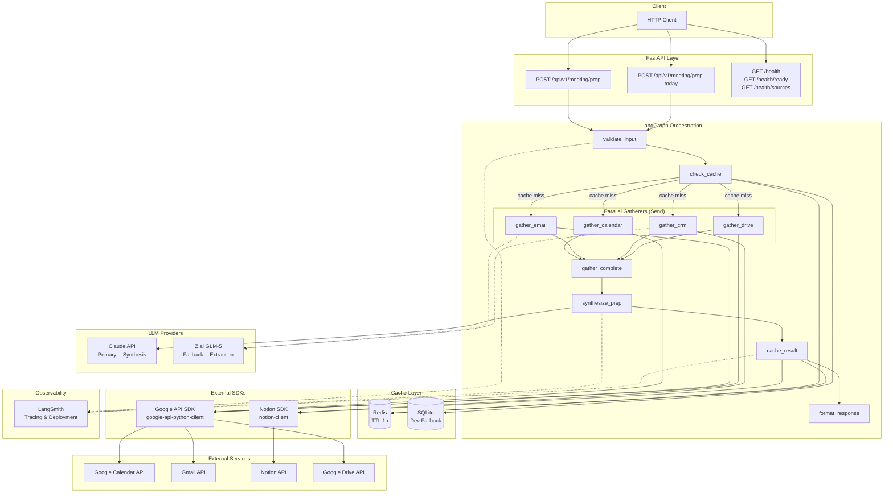
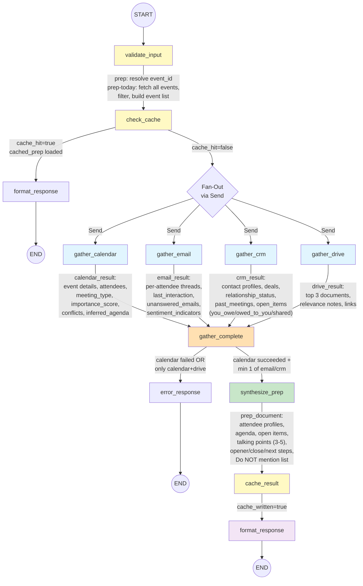
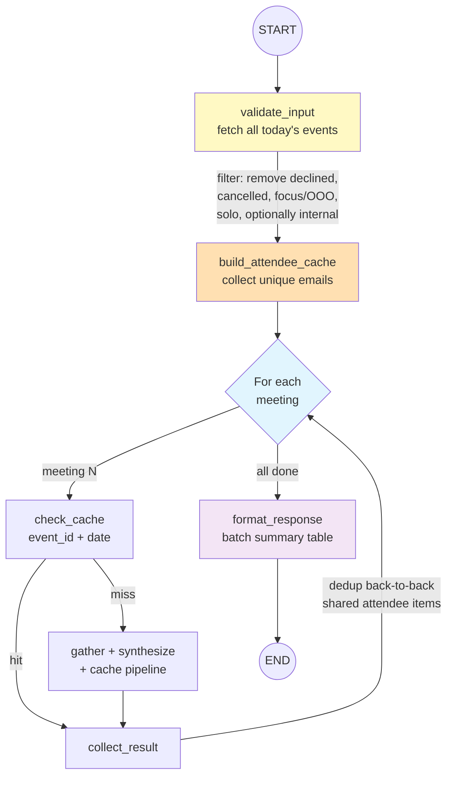
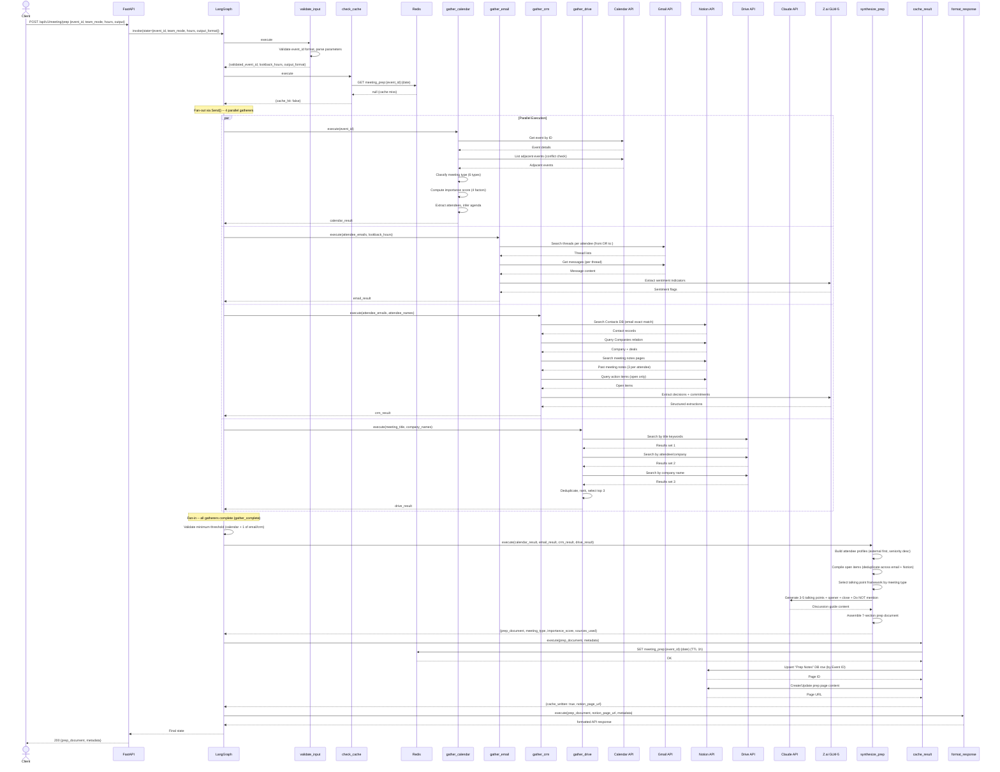
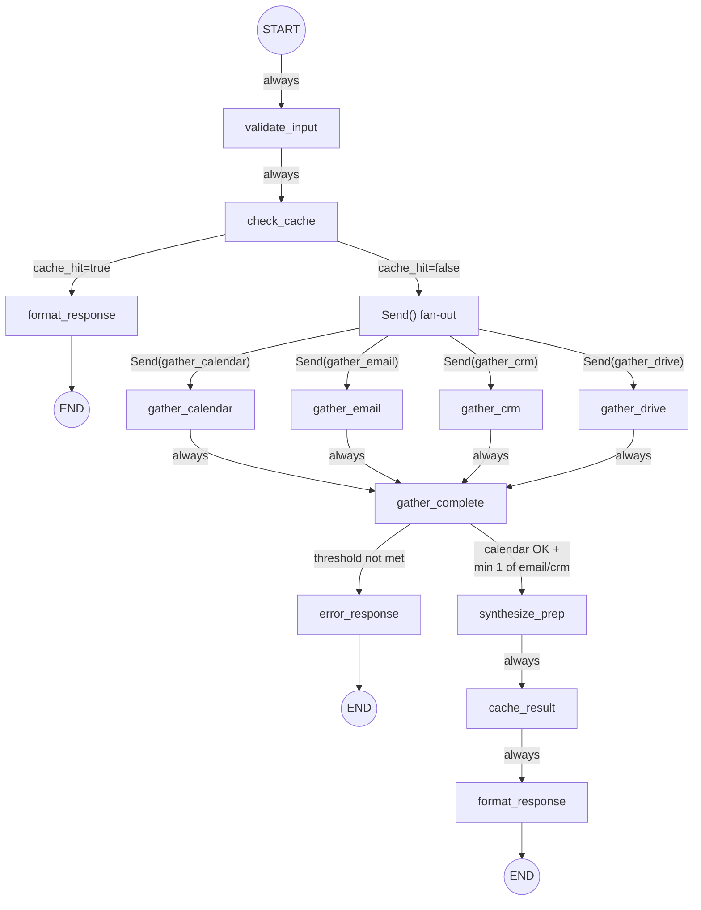
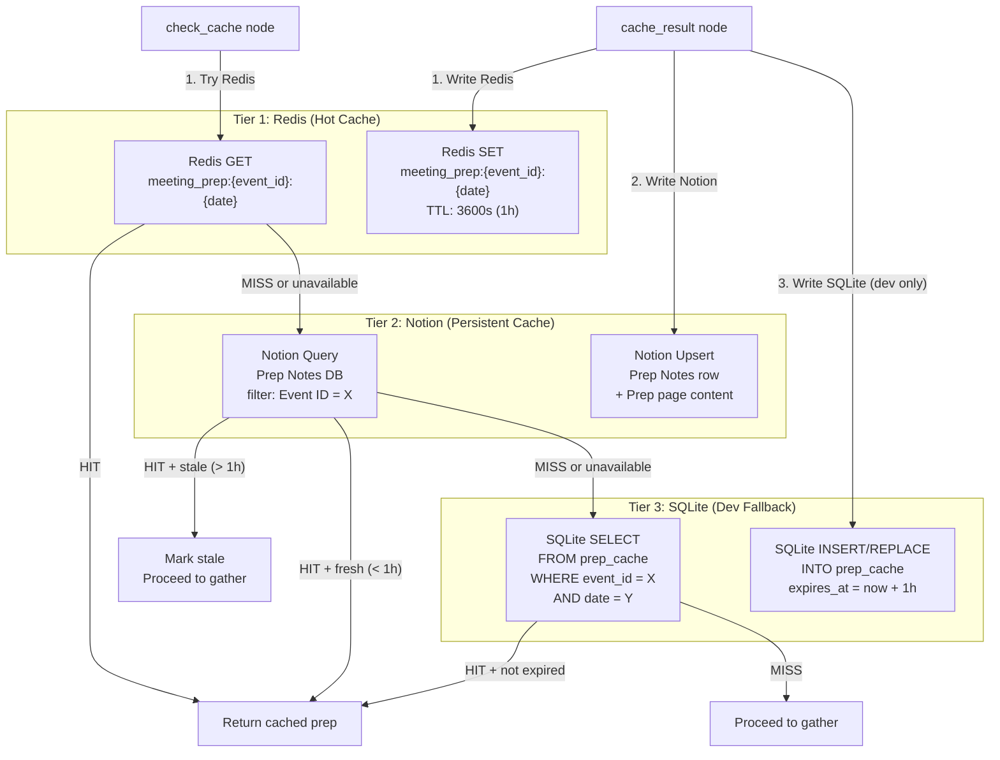
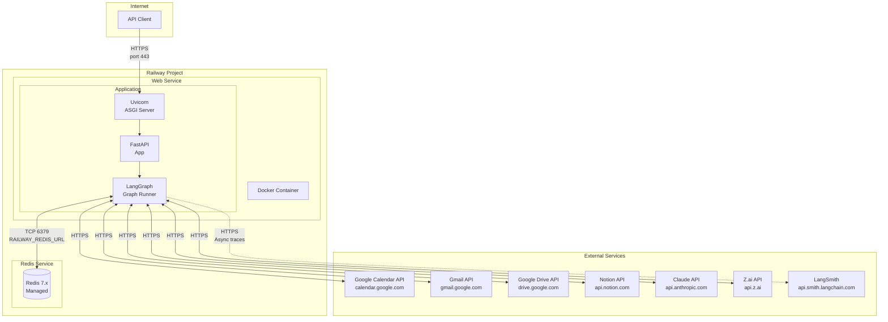
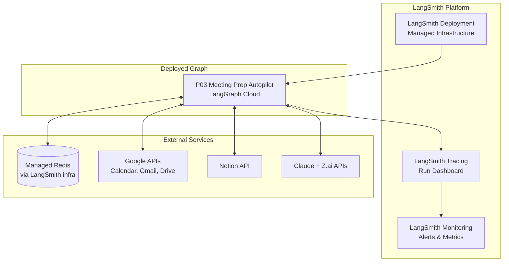

# P03 Meeting Prep Autopilot -- System Architecture

> LangGraph agent service implementing a parallel-gathering pattern with 4 gatherer nodes and 1 synthesis lead. Aggregates calendar event details, attendee email history, CRM/notes context, and Drive documents into a comprehensive meeting prep dossier with framework-based talking points, importance scoring, and Notion persistence. Supports both single-meeting prep and batch prep-today with shared attendee caching.

---

## Table of Contents

1. [Component Diagram](#1-component-diagram)
2. [Data Flow Diagram](#2-data-flow-diagram)
3. [Sequence Diagram](#3-sequence-diagram)
4. [State Schema Visual](#4-state-schema-visual)
5. [Node & Edge Definition Table](#5-node--edge-definition-table)
6. [Edge Definitions](#6-edge-definitions)
7. [Cache Architecture](#7-cache-architecture)
8. [Error Handling Flow](#8-error-handling-flow)
9. [Deployment Architecture](#9-deployment-architecture)

---

## 1. Component Diagram



**Key relationships:**

| Component | Used By Nodes | Purpose |
|-----------|---------------|---------|
| Google API SDK (`google-api-python-client`) | `gather_calendar`, `gather_email`, `gather_drive` | Calendar event fetch, Gmail thread search, Drive document search |
| Notion SDK (`notion-client`) | `gather_crm`, `cache_result` | CRM contact/deal/notes queries, prep note persistence |
| Claude API | `synthesize_prep` | Primary LLM for talking point generation, framework application, prep document synthesis |
| Z.ai GLM-5 | `gather_email`, `gather_crm` | Cost-efficient LLM for sentiment extraction, decision/action item parsing |
| Redis | `check_cache`, `cache_result` | Fast TTL-based prep cache (production) |
| SQLite | `check_cache`, `cache_result` | Development cache fallback |
| LangSmith | All nodes | Distributed tracing, run observability, deployment target |

---

## 2. Data Flow Diagram



### Prep-Today Batch Flow



**Data cardinality through the pipeline:**

| Stage | Input Records | Output Records |
|-------|--------------|----------------|
| validate_input | 1 event_id (prep) or 0 (prep-today) | 1 validated event or N filtered events |
| check_cache | 1 event_id + date | 0 or 1 cached prep document |
| gather_calendar | 1 event_id | 1 event + N attendees + meeting type + importance score |
| gather_email | N attendee emails | N per-attendee thread contexts (90-day default) |
| gather_crm | N attendee emails/names | N contact profiles + N deals + N past meetings + open items |
| gather_drive | 1 meeting title + N company names | Top 3 ranked documents |
| synthesize_prep | 4 gatherer results | 1 prep document (7 sections) + talking points + discussion guide |
| cache_result | 1 prep document | 1 Redis entry + 1 Notion page + 1 DB row |
| format_response | 1 prep document | 1 API response |

---

## 3. Sequence Diagram

This diagram shows the full request lifecycle for a **cache-miss** scenario on the `/meeting/prep` endpoint.



---

## 4. State Schema Visual

The LangGraph `MeetingPrepState` TypedDict contains these fields. The table shows which nodes read (`R`) and write (`W`) each field.

| State Field | Type | validate_input | check_cache | gather_calendar | gather_email | gather_crm | gather_drive | gather_complete | synthesize_prep | cache_result | format_response |
|---|---|---|---|---|---|---|---|---|---|---|---|
| `event_id` | `str` | W | R | R | | | | | R | R | R |
| `event_ids` | `list[str] or None` | W | R | | | | | | | | R |
| `is_batch` | `bool` | W | R | | | | | | | | R |
| `team_mode` | `bool` | W | | | | | | | | | R |
| `lookback_hours` | `int` | W | | | R | | | | | | |
| `output_format` | `str` | W | | | | | | | | | R |
| `skip_internal` | `bool` | W | | | | | | | | | |
| `auto_confirm` | `bool` | W | | | | | | | | | |
| `cache_hit` | `bool` | | W | | | | | R | | | R |
| `cached_prep` | `dict or None` | | W | | | | | R | | | R |
| `calendar_result` | `dict or None` | | | W | | | | R | R | | |
| `attendees` | `list[dict]` | | | W | R | R | R | R | R | | |
| `meeting_type` | `str` | | | W | | | | | R | R | R |
| `importance_score` | `int (1-5)` | | | W | | | | | R | R | R |
| `email_result` | `dict or None` | | | | W | | | R | R | | |
| `crm_result` | `dict or None` | | | | | W | | R | R | | |
| `drive_result` | `dict or None` | | | | | | W | R | R | | |
| `prep_notes_db_id` | `str or None` | | | | | W | | | | R | |
| `gatherer_statuses` | `dict` | | | W | W | W | W | R | R | | R |
| `prep_document` | `dict (7 sections)` | | | | | | | | W | R | R |
| `talking_points` | `list[dict]` | | | | | | | | W | R | R |
| `framework_used` | `str` | | | | | | | | W | | R |
| `do_not_mention` | `list[dict]` | | | | | | | | W | | R |
| `sources_used` | `list[str]` | | | | | | | | W | R | R |
| `sources_failed` | `list[str]` | | | | | | | | W | | R |
| `cache_written` | `bool` | | | | | | | | | W | |
| `notion_page_url` | `str or None` | | | | | | | | | W | R |
| `attendee_cache` | `dict` | W | | | R | R | | | | | |
| `batch_results` | `list[dict]` | | | | | | | | | | W |
| `error` | `str or None` | W | W | W | W | W | W | W | W | W | W |

**State mutation rules:**

- `validate_input` initializes request parameters and, for prep-today, populates `event_ids` and `attendee_cache`.
- `gather_calendar` is the only node that writes `meeting_type`, `importance_score`, and the initial `attendees` list with identity data.
- `gather_email` and `gather_crm` enrich the `attendees` list with email context and CRM profiles respectively, and write their own `*_result` fields.
- `gather_complete` is a join node that reads all gatherer statuses to determine if the minimum threshold is met.
- `synthesize_prep` is the only node that reads all four `*_result` fields and produces the `prep_document`.
- `cache_result` reads the assembled document and writes to external stores; it never modifies the prep content.
- All nodes may write to `error` on failure.

---

## 5. Node & Edge Definition Table

### Node Definitions

| # | Node Name | Purpose | SDKs / Tools | LLM | Input State | Output State | Timeout | Required |
|---|-----------|---------|-------------|-----|-------------|--------------|---------|----------|
| 1 | `validate_input` | Validate request params, resolve event_id; for prep-today: fetch all events, filter, build attendee cache | `google-api-python-client` (Calendar, prep-today only) | None | HTTP request body | `event_id`, `event_ids`, `is_batch`, `lookback_hours`, `output_format`, `skip_internal`, `auto_confirm`, `attendee_cache` | 10s | Yes |
| 2 | `check_cache` | Redis/SQLite lookup by event_id + date; short-circuit if fresh | Redis, SQLite | None | `event_id`, `is_batch`, `cache_hit` | `cache_hit`, `cached_prep` | 5s | Yes |
| 3 | `gather_calendar` | Fetch event from Google Calendar, classify type (6 types with specificity precedence), compute importance (4 weighted factors), extract attendees, detect conflicts, infer agenda | `google-api-python-client` (Calendar) | None | `event_id` | `calendar_result`, `attendees`, `meeting_type`, `importance_score`, `gatherer_statuses.calendar` | 30s | Yes (mandatory source) |
| 4 | `gather_email` | Search Gmail per-attendee threads (90-day default), extract thread_count, last_interaction, unanswered_emails, recent_topics, sentiment_indicators | `google-api-python-client` (Gmail) | Z.ai (sentiment extraction) | `attendees`, `lookback_hours`, `attendee_cache` | `email_result`, `gatherer_statuses.email` | 30s | Yes (required enrichment, 1 of email/crm) |
| 5 | `gather_crm` | Notion CRM contact lookup (email > name > domain), company/deals/relationship data, past meeting notes (3 most recent per attendee), action items (you_owe/owed_to_you/shared) | `notion-client` | Z.ai (decision/action extraction) | `attendees`, `attendee_cache` | `crm_result`, `prep_notes_db_id`, `gatherer_statuses.crm` | 30s | Yes (required enrichment, 1 of email/crm) |
| 6 | `gather_drive` | Google Drive 3 parallel queries (title, attendee, company), rank by relevance, return top 3 | `google-api-python-client` (Drive) | None | `attendees`, `meeting_type` | `drive_result`, `gatherer_statuses.drive` | 30s | No (optional) |
| 7 | `gather_complete` | Join node: validate minimum threshold (calendar + at least 1 of email/crm), route to synthesis or error | None | None | All `*_result` fields, `gatherer_statuses` | Routing decision | 1s | Yes |
| 8 | `synthesize_prep` | Merge all gatherer outputs, select talking point framework (SPIN/GROW/SBI/Context-Gathering/Delta-Based/Contribution Mapping by meeting type), generate 3-5 talking points, build opener/close/next-steps, compile Do NOT mention list, assemble 7-section prep document | None (pure logic + LLM) | Claude (primary) | All `*_result` fields, `meeting_type`, `importance_score`, `attendees` | `prep_document`, `talking_points`, `framework_used`, `do_not_mention`, `sources_used`, `sources_failed` | 60s | Yes |
| 9 | `cache_result` | Write to Redis (1h TTL) + upsert Notion "Meeting Prep Autopilot - Prep Notes" DB row + create/update Notion prep page | Redis, `notion-client` | None | `prep_document`, `event_id`, `meeting_type`, `importance_score`, `sources_used`, `prep_notes_db_id` | `cache_written`, `notion_page_url` | 15s | Yes (best-effort) |
| 10 | `format_response` | Build final API response with prep document, metadata, pipeline stats | None | None | `prep_document`, `notion_page_url`, `sources_used`, `sources_failed`, `meeting_type`, `importance_score`, `framework_used`, `batch_results` | HTTP response body | 1s | Yes |

### LLM Assignment Rationale

| LLM | Assignment | Rationale |
|-----|-----------|-----------|
| Claude API | `synthesize_prep` (primary) | Complex multi-source synthesis: framework-based talking point generation, Do NOT mention reasoning, context-aware customizations (deal stage, relationship status, unanswered items) -- requires highest capability |
| Z.ai GLM-5 | `gather_email` (sentiment), `gather_crm` (decisions/actions) | Structured extraction from API responses: keyword-based sentiment flagging, decision detection from meeting notes, action item parsing -- cost-efficient for repetitive tasks |
| None | `validate_input`, `check_cache`, `gather_calendar`, `gather_drive`, `gather_complete`, `cache_result`, `format_response` | Pure data operations: API calls, filtering, ranking, caching -- no natural-language reasoning required |

### Meeting Type to Framework Mapping

| Meeting Type | Framework | Detection Priority | Enrichment Depth |
|-------------|-----------|-------------------|-----------------|
| external-client | SPIN (Situation/Problem/Implication/Need-payoff) | 1 (highest) | Maximum |
| one-on-one | GROW (Goal/Reality/Options/Way-forward) | 2 | Maximum |
| ad-hoc | Context-Gathering (5 open questions) | 3 | High |
| recurring | Delta-Based (changed/blocked/next) | 4 | Standard |
| group-meeting | Contribution Mapping (decision owner/inputs/decisions/parking lot) | 5 | Standard |
| internal-sync | SBI (Situation/Behavior/Impact) | 6 (lowest) | Light |

---

## 6. Edge Definitions



| # | From Node | To Node | Condition | Description |
|---|-----------|---------|-----------|-------------|
| 1 | `START` | `validate_input` | Always | Entry point; validates request parameters and resolves event identity |
| 2 | `validate_input` | `check_cache` | Always | Validated input passed to cache lookup |
| 3 | `check_cache` | `format_response` | `cache_hit == true` | Short-circuit: return cached prep document |
| 4 | `check_cache` | Fan-out (`Send()`) | `cache_hit == false` | Cache miss: dispatch all 4 gatherers in parallel |
| 5 | Fan-out | `gather_calendar` | Always (via `Send()`) | Parallel dispatch; mandatory gatherer |
| 6 | Fan-out | `gather_email` | Always (via `Send()`) | Parallel dispatch; uses attendees from calendar + attendee_cache |
| 7 | Fan-out | `gather_crm` | Always (via `Send()`) | Parallel dispatch; uses attendees from calendar + attendee_cache |
| 8 | Fan-out | `gather_drive` | Always (via `Send()`) | Parallel dispatch; optional, uses meeting title + company names |
| 9 | `gather_calendar` | `gather_complete` | Always (fan-in) | Gatherer result collected |
| 10 | `gather_email` | `gather_complete` | Always (fan-in) | Gatherer result collected |
| 11 | `gather_crm` | `gather_complete` | Always (fan-in) | Gatherer result collected |
| 12 | `gather_drive` | `gather_complete` | Always (fan-in) | Gatherer result collected |
| 13 | `gather_complete` | `synthesize_prep` | `calendar OK AND (email OK OR crm OK)` | Minimum threshold met: proceed to synthesis |
| 14 | `gather_complete` | `error_response` | `calendar FAILED OR (email FAILED AND crm FAILED)` | Threshold not met: return error with troubleshooting guidance |
| 15 | `synthesize_prep` | `cache_result` | Always | Prep document assembled; persist to cache and Notion |
| 16 | `cache_result` | `format_response` | Always | Cache written (or failed); build API response |
| 17 | `format_response` | `END` | Always | Pipeline complete; return final state |

**Edge notes:**

- The fan-out uses LangGraph's `Send()` API to dispatch all 4 gatherers simultaneously.
- Fan-in is implicit: `gather_complete` is not invoked until all 4 `Send()` branches have returned (or timed out at 30s).
- `gather_email` and `gather_crm` both need the attendee list from `gather_calendar`. In the parallel architecture, they use the `attendee_cache` (pre-populated during `validate_input` for prep-today) or fall back to name-based search if calendar data is not yet available. For single-meeting prep where no pre-cache exists, gatherers use the event_id to independently resolve attendees.
- `gather_drive` is marked `optional: true` in the pipeline config. Its failure or absence does NOT count toward the minimum threshold. Calendar + Drive alone is NOT sufficient for synthesis.
- For prep-today batch mode, the outer loop in `validate_input` iterates over events, and each event runs through the full `check_cache -> gather -> synthesize -> cache` pipeline. The `attendee_cache` is shared across all meetings in the batch to avoid redundant lookups.

---

## 7. Cache Architecture

### Three-Tier Cache Strategy



### Cache Key Schema

| Tier | Key Format | Value | TTL | Eviction |
|------|-----------|-------|-----|----------|
| Redis | `meeting_prep:{event_id}:{YYYY-MM-DD}` | JSON-serialized prep document + metadata | 1 hour (3600s) | TTL expiry |
| Notion | "Meeting Prep Autopilot - Prep Notes" DB row, title = Event ID | Structured page with 9 properties + full prep content page | `Generated At` checked for freshness (1h threshold) | Overwrite on next cache write |
| SQLite | `prep_cache` table, `event_id` + `date` columns | JSON blob in `prep_document` column | `expires_at` timestamp column | Application-level check on read |

### Read Path Priority

1. **Redis** -- Sub-millisecond lookup. Used in production. If Redis is unavailable (connection error), fall through silently.
2. **Notion** -- Seconds-range lookup. Always attempted if Redis misses. Serves as human-readable persistent cache. Freshness checked via `Generated At` property (1h threshold).
3. **SQLite** -- Local file. Used only when `ENVIRONMENT=development`. Never deployed to production.

### Write Path (All Tiers)

On every fresh prep synthesis, `cache_result` writes to all available tiers in parallel. Write failures are logged but never block the pipeline -- the prep document is already assembled and will be returned to the caller regardless.

### Cache Invalidation

| Trigger | Action |
|---------|--------|
| TTL expiry (1h) | Redis key auto-deleted; Notion row stale on next read |
| Event updated in Calendar | Not auto-detected; stale cache remains until TTL. Short 1h TTL mitigates this risk |
| Re-request same event_id | Cache hit returns existing prep; use `refresh=true` to bypass |
| `refresh=true` parameter | Bypass cache read entirely; overwrite all tiers after synthesis |

### Why 1h TTL (not 24h like P20)

Meeting prep is time-sensitive and context changes rapidly as a meeting approaches. New emails arrive, action items get completed, and attendees may change. A 1-hour TTL ensures prep documents reflect near-real-time context while still avoiding redundant API calls for repeated requests within the same hour.

---

## 8. Error Handling Flow

```mermaid
graph TD
    subgraph "Input Validation Failures"
        IV_START[validate_input] --> IV_CHECK{Valid?}
        IV_CHECK -->|"event_id invalid"| IV_ERR1["400: Event not found.\nCheck event_id or run\nprep with no args"]
        IV_CHECK -->|"cancelled event"| IV_ERR2["400: Event is cancelled.\nNo prep generated"]
        IV_CHECK -->|"solo event"| IV_ERR3["400: Solo event.\nNo attendees to prep for"]
        IV_CHECK -->|"prep-today: 0 events\nafter filtering"| IV_ERR4["200: No meetings to prep.\nN events skipped (reasons)"]
        IV_CHECK -->|"declined event"| IV_WARN["Warn: You declined.\nProceed with prep"]
    end

    subgraph "Gatherer Failure Handling"
        G_START[Gatherer Executes] --> G_CHECK{Success?}
        G_CHECK -->|Yes| G_OK["Return *_result\nstatus: complete"]
        G_CHECK -->|Timeout 30s| G_TIMEOUT["Return *_result = None\nstatus: timeout\nAdd to sources_failed"]
        G_CHECK -->|SDK Error| G_ERR["Return *_result = None\nstatus: error\nAdd to sources_failed"]
        G_CHECK -->|MCP/API Unavailable| G_UNAVAIL["Return *_result = None\nstatus: unavailable\nAdd to sources_failed"]
    end

    subgraph "Minimum Threshold Enforcement"
        THR_START[gather_complete] --> THR_CHECK{Which gatherers\nsucceeded?}
        THR_CHECK -->|"Calendar + Email + CRM\n(+ optional Drive)"| FULL["Full prep document\nAll sections populated"]
        THR_CHECK -->|"Calendar + Email\n(CRM failed)"| PARTIAL_E["Partial prep:\nNo CRM profiles, no deals,\nno meeting notes.\nEmail-based context only"]
        THR_CHECK -->|"Calendar + CRM\n(Email failed)"| PARTIAL_C["Partial prep:\nNo email history,\nno sentiment, no unanswered.\nCRM-based context only"]
        THR_CHECK -->|"Calendar + Drive only\n(Email + CRM both failed)"| FAIL_DRIVE["FAIL: Calendar + Drive\ninsufficient.\nNo enrichment source"]
        THR_CHECK -->|"Calendar only"| FAIL_CAL["FAIL: Calendar alone\ninsufficient.\nNeed email or CRM"]
        THR_CHECK -->|"Calendar failed"| FAIL_MANDATORY["FAIL: Calendar is mandatory.\nCannot identify event"]
        THR_CHECK -->|"All failed"| FAIL_ALL["FAIL: All gatherers failed.\nCheck MCP config"]
    end

    subgraph "Synthesis Edge Cases"
        SYN_START[synthesize_prep] --> SYN_CHECK{Edge case?}
        SYN_CHECK -->|"15min meeting"| SHORT["Exactly 2 talking points\nCompressed opener"]
        SYN_CHECK -->|"10+ attendees"| LARGE["Top 5 profiled\nRest as Also attending"]
        SYN_CHECK -->|"No context data"| FALLBACK["Fall back to\nContext-Gathering framework"]
        SYN_CHECK -->|"Past event"| RETRO["Retrospective framing\nPast event header"]
    end

    subgraph "Post-Synthesis Error Handling"
        CACHE_FAIL["cache_result fails\n(Redis or Notion)"] --> CACHE_LOG["Log failure\nContinue pipeline\nReturn prep anyway"]
        NOTION_PAGE_FAIL["Notion page creation\nfails"] --> FALLBACK_CHAT["Output full Markdown\nto API response"]
        DB_WRITE_FAIL["Tracking DB write\nfails"] --> DB_LOG["Log warning\nReturn page URL anyway"]
    end

    subgraph "Batch (prep-today) Error Handling"
        BATCH_ONE["Single meeting\nfails in batch"] --> BATCH_SKIP["Log error\nMark FAILED in summary\nContinue to next meeting"]
        BATCH_ALL["All meetings\nfail in batch"] --> BATCH_ERR["Return summary with\nall failures + guidance"]
        BATCH_RATE["Rate limited\nmid-batch"] --> BATCH_BACKOFF["Exponential backoff\n1s, 2s, 4s\nMax 3 retries\nThen mark failed"]
    end
```



### Failure Propagation Rules

| Failure Scenario | Impact | Recovery |
|-----------------|--------|----------|
| Redis unavailable | Cache read falls through to Notion/SQLite; cache write skipped for Redis | Pipeline continues; slightly slower |
| Notion unavailable | CRM gatherer returns `status: unavailable`; cache writes to Redis/SQLite only; no Notion page created | Prep built from Calendar/Gmail/Drive; output as JSON only |
| Gmail unavailable | Email gatherer returns `status: unavailable`; no thread counts, no unanswered emails, no sentiment | Prep built from Calendar/CRM/Drive; completeness reduced |
| Google Calendar unavailable | Calendar gatherer fails; event cannot be identified | HTTP 503; pipeline aborted; Calendar is mandatory |
| Google Drive unavailable | Drive gatherer returns `status: unavailable` | Related Documents section reads "Drive not connected"; all other sections unaffected |
| Claude API unavailable | Synthesis node fails; cannot generate talking points | HTTP 503; return raw gatherer data without synthesis |
| Z.ai GLM-5 unavailable | Gatherer extraction falls back to regex/heuristic parsing | Reduced sentiment/decision extraction quality; pipeline continues |
| Single gatherer timeout (30s) | That source marked as `timeout` in `sources_failed` | Other 3 sources proceed normally |
| Prep-today: single meeting fails | That meeting marked FAILED in batch summary | Remaining meetings processed; batch continues |
| Prep-today: rate limited | Exponential backoff (1s, 2s, 4s), max 3 retries | After retries exhausted, meeting marked FAILED; batch continues |

### Minimum Viability

Per `teams/config.json`, `minimum_gatherers_required: 2`. The enforced rule is:

- **Calendar is always mandatory** -- without the event, there is nothing to prep for.
- **At least 1 enrichment source (Email or CRM) must succeed** -- Calendar alone (even with Drive) does not produce a useful prep document.
- **Drive is always optional** -- its failure never counts toward the minimum threshold.

---

## 9. Deployment Architecture

### Production: Railway



### LangSmith Deployment Variant



### Environment Variables

| Variable | Required | Description |
|----------|----------|-------------|
| `ANTHROPIC_API_KEY` | Yes | Claude API authentication |
| `ZAI_API_KEY` | Yes | Z.ai GLM-5 API authentication |
| `NOTION_API_KEY` | Yes | Notion integration token |
| `GOOGLE_CREDENTIALS_JSON` | Yes | Google service account or OAuth credentials (Calendar, Gmail, Drive) |
| `REDIS_URL` | Prod only | Redis connection string (Railway provides `RAILWAY_REDIS_URL`) |
| `LANGSMITH_API_KEY` | No | LangSmith tracing and deployment |
| `LANGSMITH_PROJECT` | No | LangSmith project name (default: `p03-meeting-prep-autopilot`) |
| `ENVIRONMENT` | No | `production` or `development` (controls SQLite fallback, debug logging) |
| `LOG_LEVEL` | No | `DEBUG`, `INFO`, `WARNING`, `ERROR` (default: `INFO`) |
| `GATHERER_TIMEOUT_SECONDS` | No | Per-gatherer timeout (default: `30`) |
| `CACHE_TTL_SECONDS` | No | Prep cache TTL (default: `3600` = 1 hour) |
| `DEFAULT_LOOKBACK_HOURS` | No | Email lookback window (default: `2160` = 90 days) |

### Container Specification

```
Base image:     python:3.12-slim
Exposed port:   8000
Healthcheck:    GET /health (interval: 30s, timeout: 5s, retries: 3)
Memory:         512 MB (minimum), 1 GB (recommended)
CPU:            0.5 vCPU (minimum), 1 vCPU (recommended)
Startup time:   < 10 seconds (Uvicorn + LangGraph graph compilation)
```

---

## Appendix: API Request/Response Schemas

### POST /api/v1/meeting/prep

**Request:**
```json
{
  "event_id": "abc123xyz",
  "team_mode": true,
  "lookback_hours": 2160,
  "output_format": "both",
  "refresh": false
}
```

**Response (200):**
```json
{
  "event_id": "abc123xyz",
  "meeting_title": "Q1 Strategy Review with Acme Corp",
  "meeting_type": "external-client",
  "importance_score": 5,
  "prep_document": {
    "header": {
      "title": "Q1 Strategy Review with Acme Corp",
      "start_time": "2026-03-05T14:00:00-08:00",
      "end_time": "2026-03-05T15:00:00-08:00",
      "duration_minutes": 60,
      "location": "https://zoom.us/j/123456789",
      "meeting_type": "external-client",
      "importance_score": 5,
      "rsvp": "accepted",
      "conflicts": null
    },
    "attendees": [
      {
        "name": "Jane Smith",
        "email": "jane@acme.com",
        "rsvp": "accepted",
        "role": "VP of Engineering",
        "company": "Acme Corp",
        "contact_type": "Decision Maker",
        "relationship_status": "Active",
        "last_interaction": "2026-02-20 via Email",
        "sentiment_flags": ["overdue (invoice #4521)"],
        "pending_items": 2,
        "active_deals": ["Acme Platform Upgrade - Proposal - $75,000"]
      }
    ],
    "agenda": [
      "Review Q1 deliverables",
      "Discuss renewal timeline",
      "[Inferred] Address open action items"
    ],
    "open_items": {
      "you_owe": [
        {"item": "Send revised timeline", "to": "Jane Smith", "days_overdue": 15}
      ],
      "owed_to_you": [
        {"item": "Provide budget approval", "from": "Jane Smith", "days_waiting": 8}
      ],
      "shared": [],
      "resolved": []
    },
    "related_documents": [
      {
        "title": "Acme Corp - Q2 Proposal v2",
        "type": "Doc",
        "modified": "2026-02-10",
        "url": "https://docs.google.com/...",
        "relevance": "Latest proposal covering Q2 deliverables and pricing"
      }
    ],
    "discussion_guide": {
      "framework": "SPIN",
      "opener": "Thank you for making time, Jane. Congratulations on the Phase 1 launch last week -- that was a significant milestone.",
      "talking_points": [
        {
          "number": 1,
          "action": "Confirm",
          "topic": "Q1 deliverable status",
          "context": "Review progress against the 5 milestones in the SOW. 3 of 5 are marked complete as of last sync."
        },
        {
          "number": 2,
          "action": "Address",
          "topic": "Revised timeline delivery",
          "context": "You owe Jane the revised timeline (promised Feb 12, 15 days overdue). Provide it proactively before she raises it."
        },
        {
          "number": 3,
          "action": "Discuss",
          "topic": "Renewal timeline and scope for Q2",
          "context": "Active deal in Proposal stage ($75K). Explore whether the Q2 scope aligns with budget expectations."
        }
      ],
      "do_not_mention": [
        {"item": "Internal cost structures", "reason": "Active deal in Proposal stage"}
      ],
      "next_steps": [
        {"action": "Send revised timeline", "owner": "You", "by": "2026-03-06"},
        {"action": "Confirm Q2 scope priorities", "owner": "Jane Smith", "by": "2026-03-12"}
      ],
      "close": "Summarize agreed timeline adjustments and confirm the follow-up meeting for Q2 scope review."
    }
  },
  "metadata": {
    "sources_used": ["google_calendar", "gmail", "notion_crm", "google_drive"],
    "sources_failed": [],
    "from_cache": false,
    "notion_page_url": "https://notion.so/Meeting-Prep-abc123",
    "generated_at": "2026-03-05T10:30:00Z",
    "pipeline_duration_ms": 8450,
    "cache_ttl_seconds": 3600
  }
}
```

### POST /api/v1/meeting/prep-today

**Request:**
```json
{
  "team_mode": false,
  "lookback_hours": 2160,
  "skip_internal": true,
  "auto_confirm": true
}
```

**Response (200):**
```json
{
  "date": "2026-03-05",
  "mode": "single-agent",
  "total_events_found": 8,
  "events_filtered": 3,
  "events_skipped_internal": 2,
  "meetings_prepped": 3,
  "meetings_failed": 0,
  "unique_attendees_profiled": 7,
  "attendee_cache_hits": 4,
  "results": [
    {
      "event_id": "abc123",
      "title": "Q1 Strategy Review with Acme Corp",
      "time": "14:00-15:00",
      "meeting_type": "external-client",
      "importance_score": 5,
      "framework": "SPIN",
      "talking_points_count": 3,
      "status": "generated",
      "notion_url": "https://notion.so/..."
    },
    {
      "event_id": "def456",
      "title": "1:1 with Alex",
      "time": "15:30-16:00",
      "meeting_type": "one-on-one",
      "importance_score": 3,
      "framework": "GROW",
      "talking_points_count": 3,
      "status": "generated",
      "notion_url": "https://notion.so/..."
    },
    {
      "event_id": "ghi789",
      "title": "Kickoff Call - New Prospect",
      "time": "16:30-17:30",
      "meeting_type": "ad-hoc",
      "importance_score": 4,
      "framework": "Context-Gathering",
      "talking_points_count": 5,
      "status": "generated",
      "notion_url": "https://notion.so/..."
    }
  ],
  "skipped_events": [
    {"title": "Focus Time", "time": "09:00-11:00", "reason": "Focus block"},
    {"title": "Team Standup", "time": "11:00-11:15", "reason": "internal (--skip-internal)"},
    {"title": "All Hands", "time": "12:00-13:00", "reason": "internal (--skip-internal)"},
    {"title": "Lunch", "time": "13:00-14:00", "reason": "Solo event"},
    {"title": "Declined: Vendor Demo", "time": "17:00-17:30", "reason": "Declined"}
  ],
  "total_prep_time_ms": 24500,
  "generated_at": "2026-03-05T08:15:00Z"
}
```

### GET /health

**Response (200):**
```json
{
  "status": "healthy",
  "service": "p03-meeting-prep-autopilot",
  "version": "1.0.0",
  "uptime_seconds": 3600
}
```

### GET /health/ready

**Response (200):**
```json
{
  "status": "ready",
  "checks": {
    "redis": "connected",
    "google_calendar": "authenticated",
    "gmail": "authenticated",
    "notion": "authenticated"
  }
}
```

### GET /health/sources

**Response (200):**
```json
{
  "google_calendar": "available",
  "gmail": "available",
  "notion": "available",
  "google_drive": "unavailable",
  "redis": "available",
  "claude": "available",
  "zai": "available"
}
```
