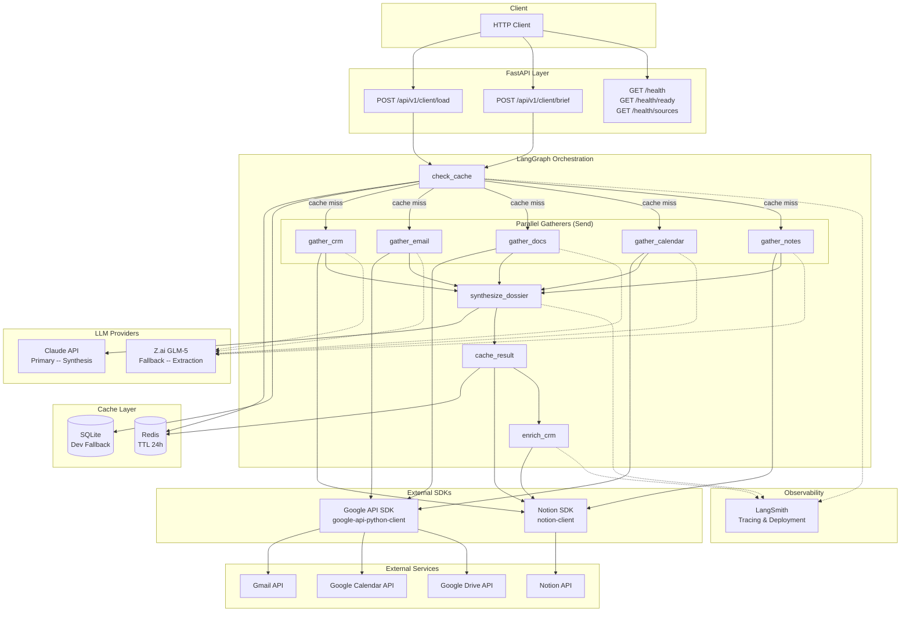
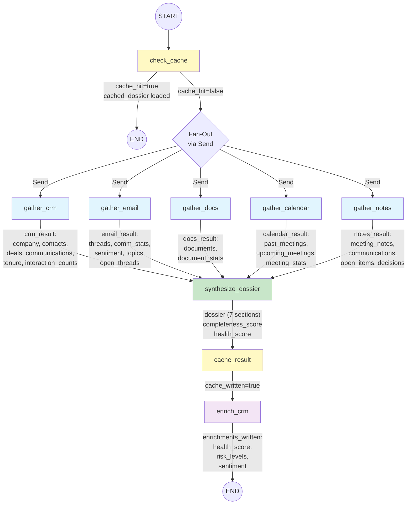
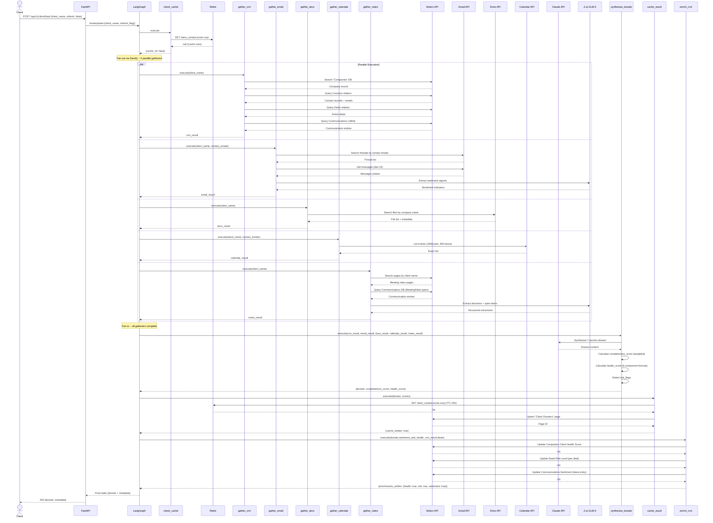
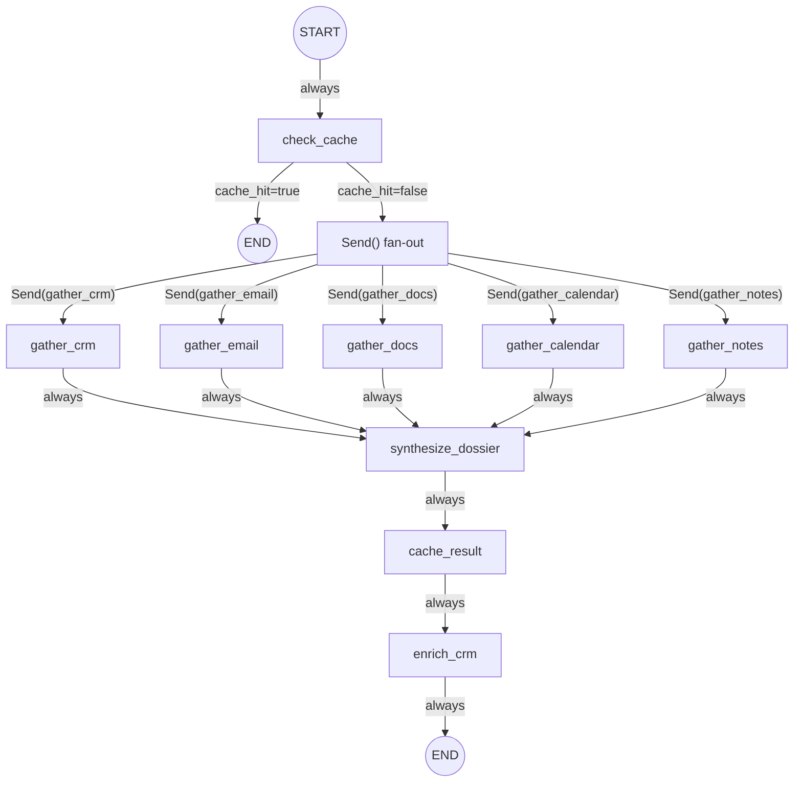
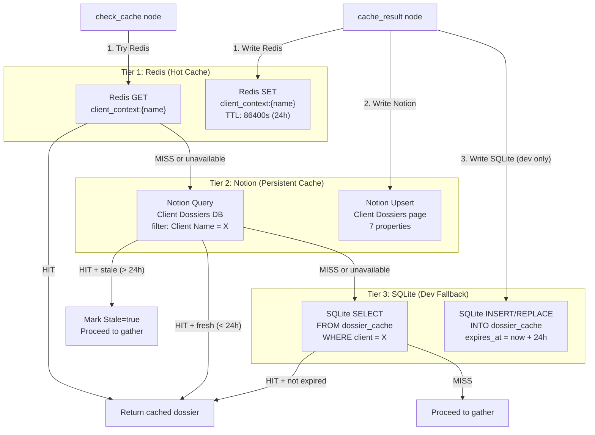
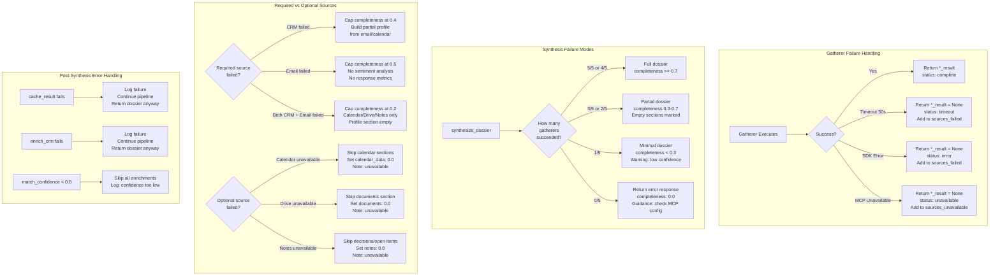
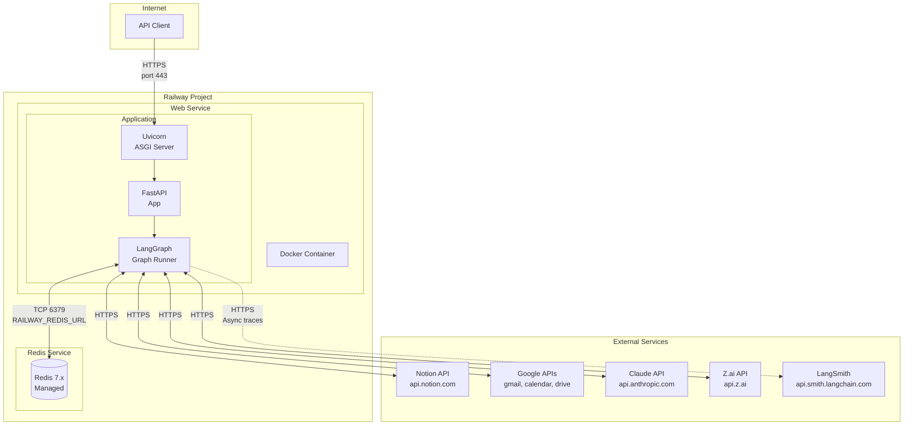
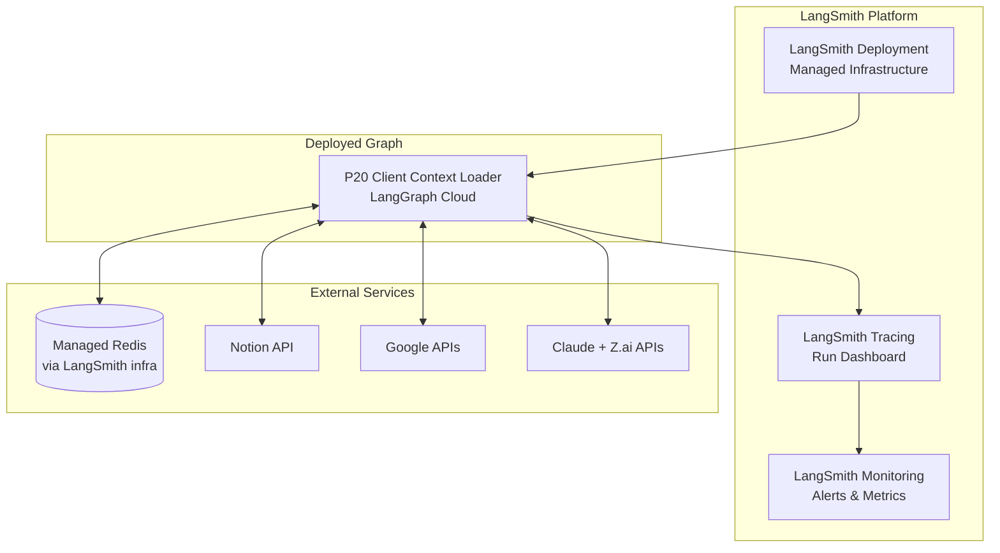

# P20 Client Context Loader -- System Architecture

> LangGraph agent service implementing a parallel-gathering pattern with 5 gatherer nodes and 1 synthesis lead. Aggregates client data from Notion CRM, Gmail, Google Calendar, Google Drive, and Notion Notes into a unified dossier with caching, health scoring, and CRM enrichment writeback.

---

## Table of Contents

1. [Component Diagram](#1-component-diagram)
2. [Data Flow Diagram](#2-data-flow-diagram)
3. [Sequence Diagram](#3-sequence-diagram)
4. [State Schema Visual](#4-state-schema-visual)
5. [Node & Edge Definition Table](#5-node--edge-definition-table)
6. [Edge Definitions](#6-edge-definitions)
7. [Cache Architecture](#7-cache-architecture)
8. [Error Handling Flow](#8-error-handling-flow)
9. [Deployment Architecture](#9-deployment-architecture)

---

## 1. Component Diagram



**Key relationships:**

| Component | Used By Nodes | Purpose |
|-----------|---------------|---------|
| Notion SDK (`notion-client`) | `gather_crm`, `gather_notes`, `cache_result`, `enrich_crm` | CRM reads, notes queries, dossier cache persistence, enrichment writeback |
| Google API SDK (`google-api-python-client`) | `gather_email`, `gather_calendar`, `gather_docs` | Gmail threads, Calendar events, Drive file search |
| Claude API | `synthesize_dossier` | Primary LLM for dossier synthesis, sentiment analysis, health scoring |
| Z.ai GLM-5 | `gather_crm`, `gather_email`, `gather_docs`, `gather_calendar`, `gather_notes` | Fallback LLM for structured extraction tasks within gatherers |
| Redis | `check_cache`, `cache_result` | Fast TTL-based dossier cache (production) |
| SQLite | `check_cache`, `cache_result` | Development cache fallback |
| LangSmith | All nodes | Distributed tracing, run observability, deployment target |

---

## 2. Data Flow Diagram



**Data cardinality through the pipeline:**

| Stage | Input Records | Output Records |
|-------|--------------|----------------|
| check_cache | 1 client name | 0 or 1 cached dossier |
| gather_crm | 1 company lookup | 1 company + N contacts + N deals + N communications |
| gather_email | N contact emails | N threads (last 180 days) |
| gather_docs | 1 company name | N documents |
| gather_calendar | N contact emails | N past events + N upcoming events |
| gather_notes | 1 company name | N meeting notes + N communications + N open items |
| synthesize_dossier | 5 gatherer results | 1 dossier (7 sections) + 1 completeness score + 1 health score |
| cache_result | 1 dossier | 1 Redis entry + 1 Notion page |
| enrich_crm | 1 dossier | N CRM property updates |

---

## 3. Sequence Diagram

This diagram shows the full request lifecycle for a **cache-miss** scenario on the `/client/load` endpoint.



---

## 4. State Schema Visual

The LangGraph `ClientContextState` TypedDict contains these fields. The table shows which nodes read (`R`) and write (`W`) each field.

| State Field | Type | check_cache | gather_crm | gather_email | gather_docs | gather_calendar | gather_notes | synthesize_dossier | cache_result | enrich_crm |
|---|---|---|---|---|---|---|---|---|---|---|
| `client_name` | `str` | R | R | R | R | R | R | R | R | R |
| `refresh_flag` | `bool` | R | | | | | | | | |
| `cache_hit` | `bool` | W | | | | | | R | | |
| `cached_dossier` | `dict or None` | W | | | | | | R | | |
| `cache_metadata` | `dict or None` | W | | | | | | | | |
| `crm_result` | `dict or None` | | W | | | | | R | | R |
| `contact_emails` | `list[str]` | | W | R | | R | | | | |
| `email_result` | `dict or None` | | | W | | | | R | | |
| `docs_result` | `dict or None` | | | | W | | | R | | |
| `calendar_result` | `dict or None` | | | | | W | | R | | |
| `notes_result` | `dict or None` | | | | | | W | R | | |
| `dossier` | `dict (7 sections)` | | | | | | | W | R | R |
| `completeness_score` | `float (0.0-1.0)` | | | | | | | W | R | |
| `completeness_breakdown` | `dict` | | | | | | | W | R | |
| `health_score` | `int (0-100)` | | | | | | | W | R | R |
| `risk_flags` | `list[dict]` | | | | | | | W | | R |
| `cache_written` | `bool` | | | | | | | | W | |
| `enrichments_written` | `dict` | | | | | | | | | W |
| `match_confidence` | `float (0.0-1.0)` | | W | | | | | R | R | R |
| `sources_used` | `list[str]` | | | | | | | W | R | |
| `sources_failed` | `list[str]` | | | | | | | W | | |
| `error` | `str or None` | W | W | W | W | W | W | W | W | W |

**State mutation rules:**
- Gatherer nodes only write their own `*_result` field plus `contact_emails` (CRM populates this for downstream gatherers).
- `synthesize_dossier` is the only node that reads all five `*_result` fields.
- `enrich_crm` reads the synthesized `dossier` and `crm_result` but never modifies them.
- All nodes may write to `error` on failure.

---

## 5. Node & Edge Definition Table

### Node Definitions

| # | Node Name | Purpose | SDKs / Tools | LLM | Input State | Output State | Timeout | Required |
|---|-----------|---------|-------------|-----|-------------|--------------|---------|----------|
| 1 | `check_cache` | Look up existing dossier in Redis (or SQLite fallback); short-circuit if fresh | Redis, SQLite | None | `client_name`, `refresh_flag` | `cache_hit`, `cached_dossier`, `cache_metadata` | 5s | Yes |
| 2 | `gather_crm` | Search Notion CRM Pro for company, contacts, deals, communications | `notion-client` | Z.ai (extraction fallback) | `client_name` | `crm_result`, `contact_emails`, `match_confidence` | 30s | Yes (required source) |
| 3 | `gather_email` | Search Gmail for threads with client contacts; extract sentiment | `google-api-python-client` (Gmail) | Z.ai (sentiment extraction) | `client_name`, `contact_emails` | `email_result` | 30s | Yes (required source) |
| 4 | `gather_docs` | Search Google Drive for documents related to client | `google-api-python-client` (Drive) | None | `client_name` | `docs_result` | 30s | No (optional) |
| 5 | `gather_calendar` | List past and upcoming meetings with client attendees | `google-api-python-client` (Calendar) | None | `client_name`, `contact_emails` | `calendar_result` | 30s | No (optional) |
| 6 | `gather_notes` | Search Notion pages and Communications DB for meeting notes and decisions | `notion-client` | Z.ai (decision/action extraction) | `client_name` | `notes_result` | 30s | No (optional) |
| 7 | `synthesize_dossier` | Merge all gatherer outputs into 7-section dossier; score completeness and health | None (pure logic + LLM) | Claude (primary) | All `*_result` fields, `cache_hit`, `cached_dossier` | `dossier`, `completeness_score`, `completeness_breakdown`, `health_score`, `risk_flags`, `sources_used`, `sources_failed` | 60s | Yes |
| 8 | `cache_result` | Persist dossier to Redis (TTL) and Notion ("Client Dossiers" DB) | Redis, `notion-client` | None | `dossier`, `completeness_score`, `health_score`, `match_confidence`, `sources_used` | `cache_written` | 15s | Yes (best-effort) |
| 9 | `enrich_crm` | Write health score, risk levels, sentiment back to CRM Pro databases | `notion-client` | None | `dossier`, `crm_result`, `health_score`, `risk_flags`, `match_confidence` | `enrichments_written` | 15s | No (best-effort) |

### LLM Assignment Rationale

| LLM | Assignment | Rationale |
|-----|-----------|-----------|
| Claude API | `synthesize_dossier` (primary) | Complex multi-source synthesis, sentiment reasoning, health score justification -- requires highest capability |
| Z.ai GLM-5 | Gatherer extraction tasks (fallback) | Structured extraction from API responses (sentiment signals, decision detection, action item parsing) -- cost-efficient for repetitive tasks |
| None | `check_cache`, `cache_result`, `enrich_crm`, `gather_docs`, `gather_calendar` | Pure data operations with no natural-language reasoning required |

---

## 6. Edge Definitions



| # | From Node | To Node | Condition | Description |
|---|-----------|---------|-----------|-------------|
| 1 | `START` | `check_cache` | Always | Entry point; every invocation begins with cache check |
| 2 | `check_cache` | `END` | `cache_hit == true AND refresh_flag == false` | Short-circuit: return cached dossier, skip all gathering |
| 3 | `check_cache` | Fan-out (`Send()`) | `cache_hit == false OR refresh_flag == true` | Cache miss or forced refresh: dispatch all 5 gatherers in parallel |
| 4 | Fan-out | `gather_crm` | Always (via `Send()`) | Parallel dispatch |
| 5 | Fan-out | `gather_email` | Always (via `Send()`) | Parallel dispatch; depends on `contact_emails` from CRM but uses fallback name search if CRM incomplete |
| 6 | Fan-out | `gather_docs` | Always (via `Send()`) | Parallel dispatch |
| 7 | Fan-out | `gather_calendar` | Always (via `Send()`) | Parallel dispatch; uses `contact_emails` when available |
| 8 | Fan-out | `gather_notes` | Always (via `Send()`) | Parallel dispatch |
| 9 | `gather_crm` | `synthesize_dossier` | Always (fan-in) | Gatherer result collected; fan-in waits for all 5 |
| 10 | `gather_email` | `synthesize_dossier` | Always (fan-in) | Gatherer result collected |
| 11 | `gather_docs` | `synthesize_dossier` | Always (fan-in) | Gatherer result collected |
| 12 | `gather_calendar` | `synthesize_dossier` | Always (fan-in) | Gatherer result collected |
| 13 | `gather_notes` | `synthesize_dossier` | Always (fan-in) | Gatherer result collected |
| 14 | `synthesize_dossier` | `cache_result` | Always | Dossier assembled; persist to cache |
| 15 | `cache_result` | `enrich_crm` | Always | Cache written (or failed); proceed to enrichment |
| 16 | `enrich_crm` | `END` | Always | Pipeline complete; return final state |

**Edge notes:**
- The fan-out uses LangGraph's `Send()` API to dispatch all 5 gatherers simultaneously.
- Fan-in is implicit: `synthesize_dossier` is not invoked until all 5 `Send()` branches have returned (or timed out).
- `gather_email` and `gather_calendar` benefit from `contact_emails` populated by `gather_crm`, but because all gatherers run in parallel, they use fallback name-based search if contact emails are not yet available. In practice, `gather_crm` often completes first and updates shared state, but the architecture does not depend on this ordering.

---

## 7. Cache Architecture

### Three-Tier Cache Strategy



### Cache Key Schema

| Tier | Key Format | Value | TTL | Eviction |
|------|-----------|-------|-----|----------|
| Redis | `client_context:{slugified_name}` | JSON-serialized dossier + metadata | 24 hours (86400s) | TTL expiry |
| Notion | "Client Dossiers" DB page, title = Client Name | Structured page with 7 properties (see context-lead agent spec) | `Stale` checkbox set after 24h | Manual or overwrite on next cache write |
| SQLite | `dossier_cache` table, `client` column | JSON blob in `dossier` column | `expires_at` timestamp column | Application-level check on read |

### Read Path Priority

1. **Redis** -- Sub-millisecond lookup. Used in production. If Redis is unavailable (connection error), fall through silently.
2. **Notion** -- Seconds-range lookup. Always attempted if Redis misses. Serves as human-readable persistent cache. Freshness checked via `Generated At` property.
3. **SQLite** -- Local file. Used only when `ENVIRONMENT=development`. Never deployed to production.

### Write Path (All Tiers)

On every fresh dossier synthesis, `cache_result` writes to all available tiers in parallel. Write failures are logged but never block the pipeline -- the dossier is already assembled and will be returned to the caller regardless.

### Cache Invalidation

| Trigger | Action |
|---------|--------|
| TTL expiry (24h) | Redis key auto-deleted; Notion `Stale` checkbox set on next read |
| `refresh=true` parameter | Bypass cache read entirely; overwrite all tiers after synthesis |
| Client name change in CRM | Not auto-detected; stale cache remains until TTL or manual refresh |

---

## 8. Error Handling Flow



### Failure Propagation Rules

| Failure Scenario | Impact | Recovery |
|-----------------|--------|----------|
| Redis unavailable | Cache read falls through to Notion/SQLite; cache write skipped for Redis | Pipeline continues; slightly slower |
| Notion unavailable | CRM + Notes gatherers return `status: unavailable`; cache writes to Redis/SQLite only | Dossier built from Gmail/Calendar/Drive |
| Gmail unavailable | Email gatherer returns `status: unavailable` | No sentiment analysis; completeness capped |
| Google APIs unavailable | Email + Calendar + Docs gatherers fail | CRM + Notes only (Notion-based dossier) |
| Claude API unavailable | Synthesis node fails | Return raw gatherer data without synthesis; HTTP 503 |
| Z.ai GLM-5 unavailable | Gatherer extraction falls back to regex/heuristic parsing | Reduced extraction quality; pipeline continues |
| All 5 gatherers fail | Synthesis returns `completeness: 0.0` | HTTP 200 with empty dossier + error guidance |
| Single gatherer timeout (30s) | That source marked as `timeout` in `sources_failed` | Other 4 sources proceed normally |

### Minimum Viability

Per `teams/config.json`, `minimum_gatherers_required: 1`. The pipeline produces a dossier as long as at least one gatherer returns data. The completeness score transparently communicates data confidence to the caller.

---

## 9. Deployment Architecture

### Production: Railway



### LangSmith Deployment Variant



### Environment Variables

| Variable | Required | Description |
|----------|----------|-------------|
| `ANTHROPIC_API_KEY` | Yes | Claude API authentication |
| `ZAI_API_KEY` | Yes | Z.ai GLM-5 API authentication |
| `NOTION_API_KEY` | Yes | Notion integration token |
| `GOOGLE_CREDENTIALS_JSON` | Yes | Google service account or OAuth credentials (Gmail, Calendar, Drive) |
| `REDIS_URL` | Prod only | Redis connection string (Railway provides `RAILWAY_REDIS_URL`) |
| `LANGSMITH_API_KEY` | No | LangSmith tracing and deployment |
| `LANGSMITH_PROJECT` | No | LangSmith project name (default: `p20-client-context-loader`) |
| `ENVIRONMENT` | No | `production` or `development` (controls SQLite fallback, debug logging) |
| `LOG_LEVEL` | No | `DEBUG`, `INFO`, `WARNING`, `ERROR` (default: `INFO`) |
| `GATHERER_TIMEOUT_SECONDS` | No | Per-gatherer timeout (default: `30`) |
| `CACHE_TTL_HOURS` | No | Dossier cache TTL (default: `24`) |

### Container Specification

```
Base image:     python:3.12-slim
Exposed port:   8000
Healthcheck:    GET /health (interval: 30s, timeout: 5s, retries: 3)
Memory:         512 MB (minimum), 1 GB (recommended)
CPU:            0.5 vCPU (minimum), 1 vCPU (recommended)
Startup time:   < 10 seconds (Uvicorn + LangGraph graph compilation)
```

---

## Appendix: API Request/Response Schemas

### POST /api/v1/client/load

**Request:**
```json
{
  "client_name": "Acme Corp",
  "refresh": false,
  "lookback_hours": 4320,
  "team_mode": true
}
```

**Response (200):**
```json
{
  "client_name": "Acme Corp",
  "dossier": {
    "profile": { },
    "relationship_history": { },
    "recent_activity": [ ],
    "open_items": [ ],
    "upcoming": [ ],
    "sentiment_and_health": {
      "overall_sentiment": "positive",
      "email_sentiment": "positive",
      "meeting_sentiment": "stable",
      "deal_sentiment": "positive",
      "engagement_level": "high",
      "engagement_trend": "stable",
      "risk_flags": [],
      "health_score": 82,
      "health_label": "Excellent"
    },
    "key_documents": [ ]
  },
  "metadata": {
    "completeness_score": 0.92,
    "completeness_breakdown": {
      "crm_profile": 1.0,
      "contacts": 1.0,
      "deal_status": 1.0,
      "email_history": 1.0,
      "calendar_data": 0.5,
      "documents": 1.0,
      "notes_decisions": 0.5
    },
    "sources_used": ["notion_crm", "gmail", "google_drive", "google_calendar", "notion_notes"],
    "sources_failed": [],
    "sources_unavailable": [],
    "match_confidence": 1.0,
    "from_cache": false,
    "generated_at": "2026-03-05T10:30:00Z",
    "cache_ttl_hours": 24
  }
}
```

### POST /api/v1/client/brief

**Request:**
```json
{
  "client_name": "Acme Corp"
}
```

**Response (200):** Returns an executive brief (markdown string) generated from the cached or freshly-built dossier, following the Executive Brief Template defined in the `relationship-summary` skill.

### GET /health/sources

**Response (200):**
```json
{
  "notion": "available",
  "gmail": "available",
  "google_calendar": "available",
  "google_drive": "unavailable",
  "redis": "available",
  "claude": "available",
  "zai": "available"
}
```
